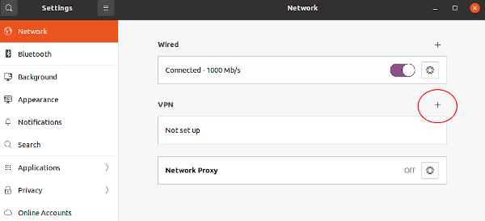
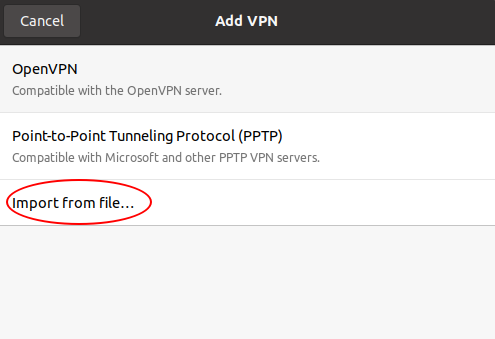
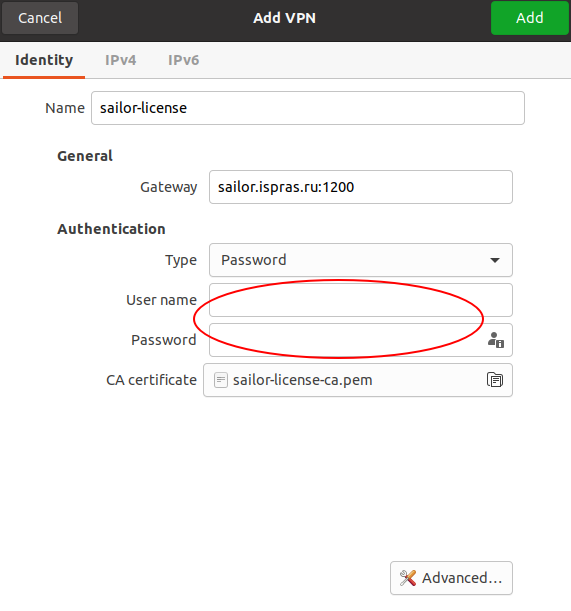
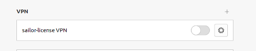
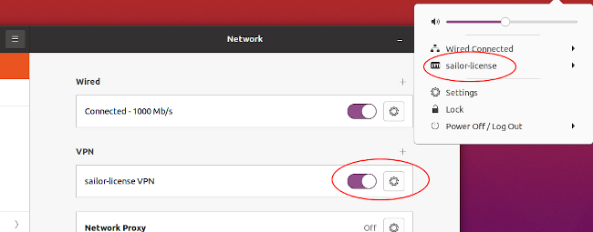

<div style="page-break-before:always;">
</div>

# <a name="app_license"></a>Приложение 1. Настройка окружения для использования лицензированного Natch

Для использования лицензированной версии инструмента *Natch* необходимо иметь HASP ключ или сетевую лицензию.

При наличии ключа следует выполнить только пункт 1 из этого приложения. В случае с сетевой лицензией необходимо выполнить
все нижеописанные действия.

Все необходимые файлы настройки будут предоставлены пользователю, а именно, пакет aksusbd_*current_version*\_amd64.deb (Ubuntu, Debian)/haspd-_*current_version*\_x86_64.rpm (Alt), файл с конфигурацией vpn ``*.ovpn`` и логин/пароль для подключения.

1. Установить окружение для ключей Sentinel

**Для Ubuntu, Debian**

Установить deb пакет `aksusbd` с помощью команды:
```bash
    sudo dpkg -i aksusbd_*current_version*_amd64.deb
```

**Для Alt**

Установить rpm пакет `haspd` и перезапустить службу:
```bash
    sudo rpm -i haspd-_*current_version*_x86_64.rpm
    sudo systemctl restart haspd
```

2. Создать VPN соединение (в качестве примера хостовой системы использована Ubuntu 20.04).

Для этого создания VPN соединения необходимо открыть настройки операционной системы и перейти в раздел *Network*. В секции *VPN* нажать на плюсик.

<figcaption>_Настройки сети_</figcaption>

Появится окно для добавления новой конфигурации VPN. Нужный вариант *Import from file..*, куда следует передать входящий в поставку
файл *\*.ovpn*. В предлагаемой ОС OpenVPN установлен по умолчанию.

<figcaption>_Импорт настроек VPN_</figcaption>

После импорта файла появится окно настройки соединения, в которое необходимо вписать логин и пароль, так же входящие в поставку.
В этом же окне следует перейти на вкладки IPv4 и IPv6 и установить флажок ``Use this connection only for resources on its network``.
Далее осталось нажать кнопку *Add* в верхнем правом углу и конфигурация будет создана.


<figcaption>_Добавление конфигурации VPN_</figcaption>

Осталось только включить переключатель напротив VPN и соединение будет установлено.

<figcaption>_VPN готов_</figcaption>

Кроме того, управлять подключением можно в трее, как показано на рисунке ниже.

<figcaption>_Подключение VPN_</figcaption>

3. Открыть браузер и ввести строку ``localhost:1947``

4. Откроется главная страница ``Sentinel Admin Control Center``, на которой нужно перейти в раздел ``Configuration``, в нем найти раздел ``Access to Remote License Managers``.

5. Убедиться, что в полях ``Allow Access to Remote Licenses`` и ``Broadcast Search to Remote Licenses`` стоят галочки.

6. В поле ``Remote License Search Parameters`` ввести ``license.intra.ispras.ru`` и нажать кнопку ``Submit``.

После всех проделанных действий инструмент готов к использованию на вашем компьютере.

