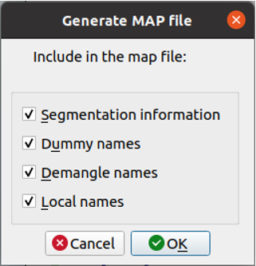

<div style="page-break-before:always;">
</div>


# <a name="app_preparation"></a>Приложение 8. Рекомендации по подготовке объекта оценки

Для того чтобы воспользоваться инструментом *Natch* необходимо подготовить образ системы,
совместимый с виртуальной машиной QEMU.

* Объект оценки должен быть собран внутри образа, а бинарные файлы выгружены наружу, чтобы
и в гостевой и хостовой системах имелись одинаковые экземпляры.

* Чтобы компиляция и настройка ПО внутри виртуальной машины проходила комфортней, рекомендуется
запускать QEMU в режиме аппаратной виртуализации, что существенно ускорит работу гостевой системы.
Включается виртуализация с помощью ключа `-enable-kvm`.

* Для отображения символьных имен функций в отчётах Natch,
нужно собирать ПО с отладочной информацией.
В любом современном компиляторе это достигается использованием ключа `-g`.
Если при этом отключать оптимизации (ключ `-O0`), то отображаемый в интерфейсе анализа стек вызовов будет более точным/понятным.

* Если по какой-то причине собрать программу с отладочной информацией невозможно, то для получения символов *Natch* может использовать
map-файлы. Получение map-файлов для исполняемого файла возможно с помощью сторонних инструментов.
Например, для генерации map-файла можно применить бесплатную версию дизассемблера
[IDA Pro](https://hex-rays.com/ida-free/). Для этого необходимо скачать установочный комплект по указанной ссылке и, возможно,
доустановить библиотеки Qt:
```bash
apt install -y qt5-default
```
После установки IDA необходимо запустить её, открыть интересующий исполняемый файл.

<figcaption>_Загрузка бинарного файла в IDA Pro_</figcaption>

Пройти процедуру генерации map-файла.

<figcaption>_Генерация map-файла_</figcaption>

Обязательным пунктом является только *Segmentation information*, остальные по желанию.

<figcaption>_Выбор опций map-файла_</figcaption>

 Полученный map-файл должен быть помещен в папку с исполняемыми файлами, которые будут переданы в *Natch*.
 Имя map-файла должно соответствовать имени бинарного файла, например, `program` -> `program.map`, `lib_x.so` -> `lib_x.so.map`.

* Если вы используете нестандартную сборку Python-интерпретатора, его тоже следует выгрузить из гостевой системы и получить для него
отладочные символы.

* Анализ кластеров из нескольких гостевых систем возможен по отдельности -- для каждой гостевой системы запускается отдельный экземпляр *Natch*.
Кластер можно связать через виртуальный коммутатор. Генерация совокупной интегральной поверхности атаки и ее единого графического представления не поддерживается.

* Если в вашей системе используются docker-контейнеры, то, на данный момент, для получения максимально возможной
информации о них, сохранять состояние машины следует до запуска контейнеров.

