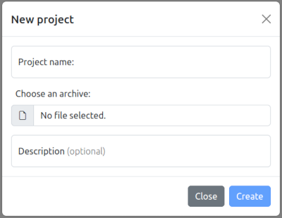
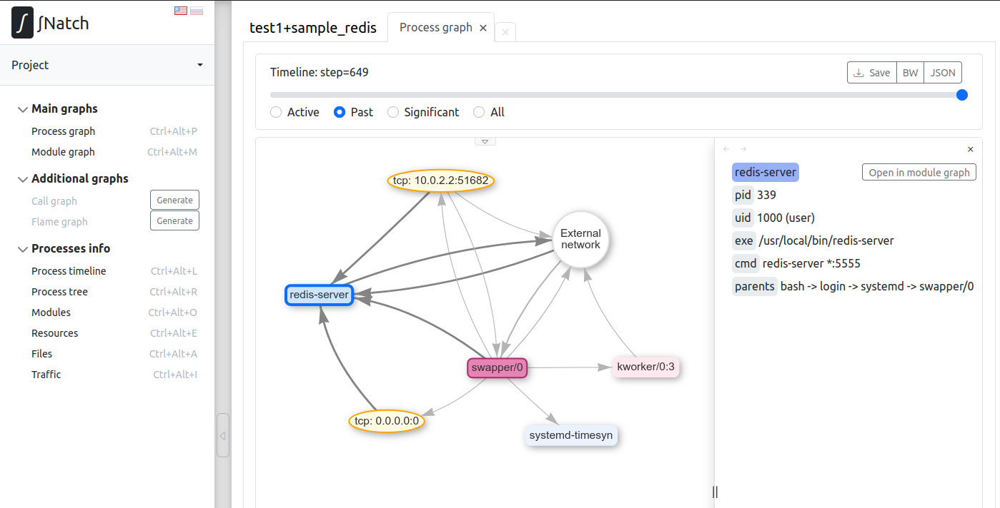
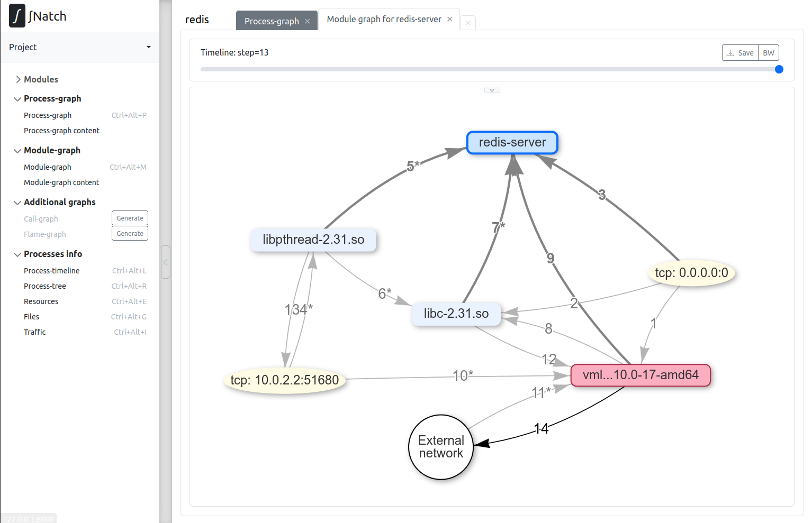
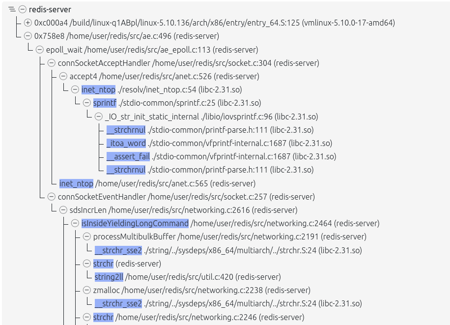

<div style="page-break-before:always;">
</div>

# <a name="natch_stepbystep"></a>3. Пошаговое руководство по работе с Natch

В этом раздела представлен пошаговый разбор работы с *Natch*, а так же немного затронут инструмент *SNatch*
(подробности в разделе [Анализ поверхности атаки с помощью SNatch](8_snatch.md#snatch)).

Для работы с инструментом *Natch* нужны входные данные, а именно, подготовленный образ системы с собранным в нем объектом оценки, а так же бинарные файлы самого объекта оценки.
Чтобы быстро попробовать *Natch*, разработчики подготовили образ и несколько примеров, на которых можно поэкспериментировать без лишних трудозатрат.

Предполагается, что *Natch* и зависимости уже установлены в системе, но если это не так, перейдите в раздел [Установка и настройка Natch](2_setup.md#setup_natch).

Нижеописанные действия были проделаны на примере хостовой ОС Ubuntu 20.


## 3.1. Получение образа и тестовых примеров

Подготовленный разработчиками [тестовый набор](https://nextcloud.ispras.ru/index.php/s/testing_2.0) включает в себя минимизированный образ гостевой операционной системы Debian
(размер qcow2-образа около 1 ГБ), а также два комплекта программ (Sample1_bins и Sample2_bins), собранных с отладочными символами.

Команда для скачивания тестового комплекта с помощью *curl* выглядит так:
```bash
curl -o materials.zip 'https://nextcloud.ispras.ru/index.php/s/testing_2.0/download'
````

После скачивания обучающих материалов их следует распаковать.

Образ гоствой ОС находится в папке `Natch_testing_materials`. Учётные записи пользователей: `user/user` и `root/root`.


**Сценарий использования тестового комплекта Sample1_bins**

Программа *test_sample* читает файл *sample.txt*, в первой строке которого записан адрес Google. Он передает эту строку в качестве параметра программе *test_sample_2*.
Программа *test_sample_2* "курлит гугл" в файл *curl.txt*.
В образе исполняемые файлы находятся в папке `/home/user/Sample1`, там же расположены и исходные коды.

Запуск тестового сценария:
```
cd Sample1
./test_sample
```

**Сценарий использования тестового комплекта Sample2_bins**

В ходе сценария необходимо запустить `redis-server` внутри виртуальной машины, в хостовой же системе запустить клиент `redis-cli` и отправить на сервер несколько запросов.

Команда для запуска `redis-server`:

```
redis-server --port 5555 --protected-mode no
```

Команда запуска клиентской улититы:

```
redis-cli -h localhost -p 49152
```

Утилиту `redis-cli` можно поставить в вашу систему (`sudo apt install redis-tools`), либо воспользоваться бинарным файлом `redis-cli` из тестового набора
(необходимо будет выставить права на исполнение).

Далее выполнить какие-нибудь действия, например `SET b VeryBigValue`, `GET b`.

В тестовом образе redis установлен в систему.


## <a name="config_natch_test_image"></a>3.2. Создание проекта для работы с тестовым образом ОС

Работа с Natch начинается с создания проекта (рабочей директории), которая осуществляется с помощью инетрактивного скрипта.
Помимо этого, процесс настройки созданного проекта может включать ручной этап, который предполагает внесение изменений в
конфигурационные файлы инструмента.
Предназначение файлов конфигурации и их параметров описано в разделе [Конфигурационные файлы Natch](4_configs.md#natch_config_main). (--ССЫЛКА--)

### 3.2.1. Создание проекта

Создание проекта выполняется [интерактивным скриптом](#natch_run_script) (--ССЫЛКА--) `natch_run.py`. Приведем вопросы скрипта и ответы на них.

Запустим скрипт:
```text
user@natch1:~/natch_quickstart$ /usr/bin/natch/bin/natch_scripts/natch_run.py Natch_testing_materials/test_image_debian.qcow2

Image: /home/user/natch_quickstart/Natch_testing_materials/test_image_debian.qcow2
OS: Linux

Attention! To successfully create a project you will need a root password
```
Скрипт выдаст предупреждение о том, что в процессе настройки потребуется пароль администратора. Требование обязательное,
при его отсутствии дальнейшая работа не будет иметь смысла.

Вводим имя проекта - будет создан каталог с таким именем:
```text
Enter path to directory for project (optional): test1
Directory for project files '/home/user/natch_quickstart/test1' was created
```

Скрипт проверит наличие и доступность утилиты `natch-qemu-img`, которая будет необходима в дальнейшей настройке и работе. В случае успеха увидим:
```text
Checking natch-qemu-img utility...
Utility natch-qemu-img is ok
```
Если что-то пошло не так, скрипт прекратит работу.

Сколько памяти выдать гостевой виртуальной машине (постфикс указывать обязательно. G или M):
```text
Common options
Enter RAM size with suffix G or M (e.g. 4G or 256M): 4G
```
Далее можно выбрать режим работы эмулятора -- графический или текстовый. По умолчанию графический.
```text
Do you want to run emulator in graphic mode? [Y/n] y
```

Если наш сценарий предполагает передачу помеченных данных по сети (далее мы рассматриваем в качестве основного как раз сценарий №2 --
взаимодействие с redis-сервером, слушающим tcp-порт 5555), нам потребуется взаимодействовать с сетевыми сервисами гостевой ОС с помощью программ,
запущенных на хосте. Указываем *Natch*, какой порт мы хотим пробросить в гостевую ОС:

```text
Network option
Do you want to use ports forwarding? [Y/n] y
Do you want to taint source ports too? [Y/n] n
Write the ports you want separated by commas (e.g. 7777, 8888, etc) 5555
Your pair of ports for connecting: 5555 <=> 49152
```

Теперь скрипт задаст ряд вопросов, реакция на которые будет не сразу. Произойдет сбор сведений, а затем
наступит автоматическая фаза, где в соответствии с выбранными характеристиками будут происходить действия.

Первый из вопросов касается конфигурационного файла для модулей. Мы согласимся на его создание и
нам нужно будет указать путь к каталогу на хосте, содержащем копии бинарных файлов, размещенных в гостевой ОС.
Находятся они в папках `Sample1_bins` и `Sample2_bins` в тестовых материалах.
Так как будет проделан пример с `redis`, то следует указать путь к папке `Sample2_bins`.
Если для другого вашего сценария бинарные файлы отсутствуют, можно отказаться создавать конфигурационный файл модулей.

```text
Modules part
Do you want to create module config? [Y/n] y
Enter path to binaries dir: /home/user/natch_quickstart/Natch_testing_materials/Sample2_bins
```

Затем будет предложено скачать отладочные символы для системных модулей. Соглашаемся, в общем, так следует поступать в
большинстве случаев.

```text
Debug info part
Do you want to get debug info for system modules? [Y/n] y
```

Финальный вопрос касается генерации конфигурационного файла, содержащего смещения структур ядра исследуемой ОС.
Без этого файла работа инструмента невозможна. Соглашаемся.

```text
Generate config file task.cfg? (recommended) [Y/n] y
```

Последнее, что надо ввести пользователю - пароль администратора. Перед запросом появится информация о найденных модулях,
если они были загружены.

```text
Waiting for module config generating
Module config is completed

Your config file module.cfg for modules was created
ELF files found: 2
Map files found: 0

The steps above require a root password

[sudo] password for user:

```

Далее скипт уходит в автоматическую работу, которая может занять продолжительное время.
На этом этапе произойдет монтирование образа, поиск системных библиотек и интерпретаторов,
скачивание отладочной информации для них. Затем будет формироваться конфигурационный файл `task.cfg`,
для чего потребуется запуск эмулятора. Последним этапом будет формирование базы символов для
всех модулей из конфигурационного файла `module.cfg`.

Все это время в консоль будут выводиться сообщения примерно следующего вида:

```text
─────────────────────────────── Libraries Searching Section ───────────────────────────────────────

Reading module config - OK
Searching Binary Files...                       ━━━━━━━━━━━━━━━━━━━━━━━━━━━━━━━━━━━━━━━━ 2/2 100% 0:00:00
Searching Binary Files - OK
Searching Python Symbols - OK
Searching Java symbols - OK
Searching Kernel Symbols - OK
Searching Shared Libraries...                   ━━━━━━━━━━━━━━━━━━━━━━━━━━━━━━━━━━━━━━━━ 48/48 100% 0:00:01
Searching Shared Libraries - OK

───────────────────────────── Library-Debug Matching Section ──────────────────────────────────────

──────────────────────────────────── Debugging Symbols ────────────────────────────────────────────
Method [1/2]: Default System Location Analysis
WARNING: Folder '/mnt/point6602537/usr/lib/debug' does not exist! Method is skipped!
Searching Debugging Information...               ━━━━━━━━━━━━━━━━━━━━━━━━━━━━━━━━━━━━━━━━  0/78   0% 0:00:00
Method [2/2]: DebugInfoD
Searching Debugging Information...               ━━━━━━━━━━━━━━━━━━━━━━━━━━━━━━━━━━━━━━━━ 78/78 100% 0:10:06
Libraries with servers response...               ━━━━━━━━━━━━━━━━━━━━━━━━━━━━━━━━━━━━━━━━ 78/78 100% 0:10:06
Searching Debugging Information - OK
───────────────────────────────────── Tieddebug Symbols ───────────────────────────────────────────
Method [1/2]: Default System Location Analysis
WARNING: Folder '/mnt/point6602537/usr/lib/debug' does not exist! Method is skipped!
WARNING: Folder '/mnt/point6602537/usr/lib/debug' does not exist! Method is skipped!
Method [2/2]: DebugInfoD
Searching Tieddebug Information...               ━━━━━━━━━━━━━━━━━━━━━━━━━━━━━━━━━━━━━━━━ 2/2 100% 0:00:00
Libraries with servers response...               ━━━━━━━━━━━━━━━━━━━━━━━━━━━━━━━━━━━━━━━━ 2/2 100% 0:00:00
Searching tieddebug information - OK
Umounting img - OK

───────────────────────────────────── Result Section ──────────────────────────────────────────────

Module config statistics:
In module config there were modules                               :     2
Binaries files in qcow2 found                                     :     2

Python interpreters statistics:
Python interpreters have been found                               :     OK
Added python interpreters                                         :     46
Added debugging information for python interpreters               :     46

Kernel statistics:
WARNING: Java symbols have been found                             :     NO

Kernel statistics:
Kernel symbols have been found                                    :     OK
Added kernel symbols                                              :     1
Added debugging information for kernel                            :     1

Shared library Statistics:
Added shared libraries                                            :     31
Added debugging information for shared libraries                  :     31
Added debugging information for tied files                        :     2
ld-linux-* is always skipped and isn't counted in calculations

Your config file '/home/user/natch_quickstart/test1/module.cfg' for modules was updated

Tuning process will be started soon. Please, do not close the emulator
Three...
Two..
One.
Go!
Natch monitor - type 'help' for more information
Natch v.3.0
(c) 2020-2024 ISP RAS

Reading Natch config file...
[Tasks] No such file 'task.cfg'. It will be created.
Now tuning will be launched.

Tuning started. Please wait a little...
Generating config file: task.cfg
Trying to find 20 kernel-specific parameters
[01/20] Parameter - task_struct->pid            : Found
[02/20] Parameter - task_struct->comm           : Found
[03/20] Parameter - task_struct->group_leader   : Found
[04/20] Parameter - task_struct->parent         : Found
[05/20] Parameter - mount fields                : Found
[06/20] Parameter - files_struct fields         : Found
[07/20] Parameter - file->f_pos                 : Found
[08/20] Parameter - vm_area_struct size         : Found
[09/20] Parameter - vm_area_struct->vm_start    : Found
[10/20] Parameter - vm_area_struct->vm_end      : Found
[11/20] Parameter - vm_area_struct->vm_flags    : Found
[12/20] Parameter - mm->map_count               : Found
[13/20] Parameter - mm_struct fields            : Found
[14/20] Parameter - task_struct->mm             : Found
[15/20] Parameter - mm->arg_start               : Found
[16/20] Parameter - task_struct->state          : Found
[17/20] Parameter - socket struct fields        : Found
[18/20] Parameter - task_struct->exit_state     : Found
[19/20] Parameter - cred->uid                   : Found
[20/20] Parameter - task_struct->cred           : Found
Detected 43096 system events
Detected 20 of 20 kernel-specific parameters. Creating config file...

Tuning completed successfully!

Symbol info part
Reading symbols for loaded modules

Created symbol database for /home/user/natch_quickstart/Natch_testing_materials/Sample2_bins/redis-server
Created symbol database for /home/user/natch_quickstart/Natch_testing_materials/Sample2_bins/redis-cli
...
...
Created symbol database for /home/user/natch_quickstart/test1/libs/src/f902f8a561c3abdb9c8d8c859d4243bd8c3f928f/python3.9
Created symbol database for /home/user/natch_quickstart/test1/libs/src/cc89a8838df3652561ab61598035775fa95f8917/vmlinux-5.10.0-17-amd64
Created symbol database for /home/user/natch_quickstart/test1/libs/src/5018237bbf012b4094027fd0b96fc22a24496ea4/libpthread-2.31.so
Created symbol database for /home/user/natch_quickstart/test1/libs/src/e9d2c06479b13dd3cfa78d714d11dccf6fcbee51/libm-2.31.so
Created symbol database for /home/user/natch_quickstart/test1/libs/src/bc22349819818055008048f8001e3910ffc16dc7/libexpat.so.1.6.12
Created symbol database for /home/user/natch_quickstart/test1/libs/src/a89a9c8e4a828f47e68e2d1dafca4aae087d061d/libz.so.1.2.11
Created symbol database for /home/user/natch_quickstart/test1/libs/src/5675f6cc697d1e1fb135c65cbb0f917550fe85ac/libutil-2.31.so
Created symbol database for /home/user/natch_quickstart/test1/libs/src/118b90161526d181807818c459baee841993795b/libdl-2.31.so
Created symbol database for /home/user/natch_quickstart/test1/libs/src/2e5abcee94f3bcbed7bba094f341070a2585a2ba/libc-2.31.so

Your config file '/home/user/natch_quickstart/test1/module.cfg' for modules was updated
```

Автоматизированная настройка и создание базовых скриптов завершены успешно, всё готово к записи сценария, о чём *Natch* сообщит нам дополнительно:

```text
Configuration file natch.cfg was created.
You can edit it before using Natch.

Settings completed! Now you can launch emulator and enjoy! :)

	Natch in record mode: 'run_record.sh'
	Natch in replay mode: 'run_replay.sh'
	Qemu without Natch: 'run_qemu.sh'

File 'settings_test1.ini' was saved here: /home/user/natch_quickstart/
You can use it for creating other projects
```

В папке проекта появится конфигурационный файл `natch.cfg`, содержащий общие настройки проекта, которые можно редактировать,
кроме того после записи сценария появится (в соответствующей папке) еще один конфигурационный файл `taint.cfg`,
который тоже можно редактировать. Также в папке проекта находится файл `natch.log` --
в нём логируются основные результаты работы программ, входящих в комплект поставки *Natch*.

Кроме того, в месте вызова скрипта сохранится файл `settings_test1.ini`, который можно будет использовать для
полностью автоматического создания проекта-клона, либо файл можно отредактировать и создать проект с нужными
характеристиками. Подробнее в разделе - (--ССЫЛКА--).

### <a name="additional_settings"></a>3.2.2. Дополнительная ручная настройка

Конфигурационный файл `natch.cfg` генерируется таким образом, что дополнительные опции представлены в нем в закомментированном виде.

В качестве примера ручной настройки соберем покрытие кода по базовым блокам для просмотра в *IDA Pro*.
Для этого в конфигурационном файле `natch.cfg` предусмотрена секция `Coverage`.
Необходимо раскомментировать не только параметры секции, но и название секции в квадратных скобках.

Раскомментируем секцию `Coverage` (подробнее об предназначении секций см. пункт [Основной конфигурационный файл](4_configs.md#main_config) документации) (--ССЫЛКА--):

```ini
[Coverage]
file=coverage
taint=true
```

## <a name="record_scenario"></a>3.3. Запись сценария работы

Все настройки выполнены, можно переходить к записи сценария. Рассмотрим в качестве примера сценарий с redis-сервером (Sample2_bins).
Для записи сценария предусмотрен скрипт `run_record.sh`, запустим его:
```bash
user@natch1:~/natch_quickstart/test1$ ./run_record.sh
```
Скрипт запросит название сценария, введем `sample_redis`. Далее запустится эмулятор.

Введём логин и пароль учетной записи пользователя - `user/user` и запустим redis-сервер:
```
redis-server --port 5555 --protected-mode no
```

Тестово соединимся с ним из хостовой ОС чтобы убедиться, что система работает как надо:
```text
user@natch1:~/natch_quickstart$ redis-cli -h localhost -p 49152

localhost:49152> select 0
OK
localhost:49152> set a b
OK
localhost:49152> get a
"b"
localhost:49152> exit
```
**Важное замечание**: *весь записываемый сценарий включает в себя и этап загрузки ОС, но помеченные данные появятся практически в самом конце,
когда мы обратимся к redis-серверу. Соответственно, для существенного сокращения времени на сбор данных (последующее выполнение `run_replay.sh`)
нам необходимо сделать снапшот в точке, максимально приближенной к началу поступления помеченных данных в системе. То есть сейчас, когда от порождения
помеченных данных нас отделяет повторная отправка в redis уже знакомых нам команд*.

Нажмем `Ctrl+Alt+G`, выйдем в монитор QEMU (bash-терминал хостовой ОС в котором мы запустили `run_record.sh`) и выполним команду генерации снапшота:
```
savevm <name>
```

Обратите внимание, что для появления приглашения `(natch)`, перед вводом команды следует нажать клавишу `Enter`.
Но даже если вы сразу без приглашения введете команду, ничего страшного, она сработает.

Используем имя `ready`. Сохранение состояния займёт несколько секунд, в зависимости от размера образа и производительности компьютера в целом.
```text
user@natch1:~/natch_quickstart/test1$ ./run_record.sh
Enter scenario name: sample_redis

Natch monitor - type 'help' for more information
(natch)
Natch v.3.0
(c) 2020-2024 ISP RAS

Reading Natch config file...
Network logging enabled
Config is loaded.
You can make system snapshots with the command: savevm <snapshot_name>
Network pcap log file: "/home/user/natch_quickstart/test1/sample_redis/network.pcap"
Network json log file: "/home/user/natch_quickstart/test1/sample_redis/network.json"

(natch) savevm ready
(natch)
```

После того как снапшот был сгенерирован, снова отправим какие-нибудь данные из хостовой ОС в redis-сервер. Теперь завершим работу QEMU, закрыв графическое окно эмулятора.

Сценарий работы с `redis` записан.

Теперь в папке с нашим проектом (`test1`) появилась директория с названием сценария `sample_redis`. В ней размещены логи сетевых операций, файл журнала, оверлей диска,
и, самое главное для пользователя -- конфигурационный файл помеченных данных `taint.cfg`. На данный момент все настройки по умолчанию нам подходят.

Для каждого вновь записанного сценария будет появляться своя папка с индивидуальными настройками.

## <a name="replay_scenario"></a>3.4. Воспроизведение сценария и сбор данных для анализа

Для воспроизведения нужно запустить скрипт `run_replay.sh`.
```text
user@natch1:~/natch_quickstart/test1/$ ./run_replay.sh
```
Скрипт может принимать два параметра: название сценария и имя снапшота. В нашем случае команда могла бы выглядеть так:
```text
user@natch1:~/natch_quickstar/test1/$ ./run_replay.sh sample_redis ready
```
Если используются параметры, то они оба являются обязательными. Однако, запускать скрипт можно без параметров, он сам или загрузит нужный сценарий (если он единственный)
или предложит выбрать из списка существующих, точно так же произойдет с выбором снапшота.

Начнём воспроизведение сценария, а точнее его фрагмента, который выполнялся после создания снапшота. Это будет несколько медленнее, чем базовое выполнение.

Через какое-то время выполнение сценария завершится, графическое окно закроется, и вы увидите сообщение наподобие приведённого ниже, свидетельствующее о том,
что интересующие нас модули гостевой ОС были распознаны успешно, и, следовательно, мы получим в отчетах корректную символьную информацию.
```text
Snapshot to load: ready
Natch monitor - type 'help' for more information
(natch)
Natch v.3.0
(c) 2020-2024 ISP RAS

Reading Natch config file...
Network logging enabled
Task graph enabled
Module graph enabled
Taint enabled
Config is loaded.
File events binary log file /home/user/natch_quickstart/test1/output_sample_redis/files_b.log created successfully
Module binary log file /home/user/natch_quickstart/test1/output_sample_redis/log_m_b.log created successfully
Modules: started reading binaries
Modules: finished with 13 of 13 binaries for analysis
thread_monitor: identification method is set to a complex developed at isp approach
Started thread monitoring
Tasks: config file is open.
Process events binary log file /home/user/natch_quickstart/test1/output_sample_redis/log_p_b.log created successfully
Network json log file: "/home/user/natch_quickstart/test1/output_sample_redis/tnetwork.json"
Binary log file /home/user/natch_quickstart/test1/output_sample_redis/log_t_b.log created successfully
Binary call_stack log file /home/user/natch_quickstart/test1/output_sample_redis/log_cs_b.log created successfully
Detected module /home/user/natch_quickstart/test1/libs/src/cc89a8838df3652561ab61598035775fa95f8917/vmlinux-5.10.0-17-amd64 execution
Detected module /home/user/natch_quickstart/test1/libs/src/2e5abcee94f3bcbed7bba094f341070a2585a2ba/libc-2.31.so execution
Detected module /home/user/natch_quickstart/Natch_testing_materials/Sample2_bins/redis-server execution
Detected module /home/user/natch_quickstart/test1/libs/src/5018237bbf012b4094027fd0b96fc22a24496ea4/libpthread-2.31.so execution
Detected module /home/user/natch_quickstart/test1/libs/src/e9d2c06479b13dd3cfa78d714d11dccf6fcbee51/libm-2.31.so execution


=========== Statistics ===========

Tainted files             : 0
Tainted packets           : 147
Tainted processes         : 3
Tainted modules           : 3
Tainted file reads        : 0
Tainted memory accesses   : 21026

Compressing data. Please wait..

test1+sample_redis.tar.zst completed
```

Если работа системы завершилась успешно, и вы не поймали, например, `core dumped` (о чём стоит немедленно сообщить в [трекер](https://gitlab.ispras.ru/natch/natch-support/-/issues) с приложением всех артефактов),
можно переходить к анализу собранных данных.

После воспроизведения сценария в папке проекта появилась директория с выходными данными `output_sample_redis` и, главное, архив, который необходимо передать в графическую подсистему *SNatch*.
Название архива формируется следующим образом:` <название проекта>+<название сценария>.tar.zst`. Таким образом, записывая разные сценарии, уже готовые архивы не будут перезаписаны и могут быть
использованы повторно или переданы третьим лицам.

## <a name="snatch_analysis"></a>3.5. Анализ с использованием SNatch

*SNatch* -- это подсистема визуализации данных и статистик, собранных при воспроизведении сценария работы под управлением *Natch*.
*SNatch* реализован в формате веб-службы с браузерным интерфейсом просмотра.

В комплект поставки *SNatch* входят скрипты `snatch_start.sh` и `snatch_stop.sh` для запуска и остановки *SNatch* соответственно.
Скрипт `snatch_start.sh` запускает необходимые для работы службы, а также открывает браузер с интерфейсом.
В терминал, из которого был запущен скрипт, будут приходить сообщения от сервера, однако, он свободен для использования,
поэтому по окончании работы из него же можно запустить скрипт `snatch_stop.sh` для остановки служб.
Запускать `snatch_stop.sh` следует всегда, в противном случае процессы останутся висеть в памяти вашего компьютера до перезагрузки.

Полное руководство пользователя *SNatch* доступно в разделе [Анализ поверхности атаки с помощью SNatch](7_snatch.md#snatch), здесь же приведем краткий обзор некоторых аналитик.

Запустим *SNatch*:
```bash
user@natch1:~/natch_quickstart$ ./snatch/snatch_start.sh
```
Создадим проект на основе собранных данных (необходимо указывать tar.zst-архив, формируемый *Natch* в каталоге проекта по результатам выполнения `run_replay.sh`):

<figcaption>_Создание Snatch проекта_</figcaption>

Через некоторое время процесс загрузки архива завершится и станут доступны различные виды аналитик (*их число и возможности постоянно нарастают*).

Главное окно представляет динамическую визуализацию распространения помеченных данных.
Ярким цветом на каждом шаге *Timeline* выделяются сущности, взаимодействующие на данном конкретном шаге *Timeline*.

Кликнув по процессу *redis-server* мы увидим боковую панель с информацией об этом процессе.

<figcaption>_Интерфейс *SNatch*_</figcaption>

На боковой панели так же находится кнопка для перехода на граф модулей, связанных с выбранным процессом.
На рисунке ниже представлен граф модулей для процесса `redis-server`.

<figcaption>_Модуль граф для redis-server_</figcaption>

Для просмотра таких аналитик, как граф вызовов и флейм граф, следует их предварительно сгенерировать, нажав на соответствующие кнопки *Generate*.

Фрагмент графа вызовов для примера с redis-server представлен на рисунке ниже. Голубым цветом выделены функции, работавшие с помеченными данными.

<figcaption>_Граф вызовов_</figcaption>

Подробнее о возможностях *SNatch* написано в разделе [Анализ поверхности атаки с помощью SNatch](8_snatch.md#snatch).

## 3.6. Просмотр сетевого трафика в Wireshark

Анализировать трафик в Wireshark можно прямо из интерфейса *SNatch* с помощью раздела *Traffic*. Здесь можно увидеть интерфейсы и сессии, клик по каждой записи будет открывать Wireshark с соответствующими данными.

<figcaption>_Информация о трафике_</figcaption>

Так же можно открывать только помеченный трафик, трафик, относящийся к сценарию, а так же весь трафик с помощью соответствующих кнопок.

<figcaption>_Исследование трафика в Wireshark_</figcaption>

## 3.7. Изменение настроек проекта дополнительными скриптами

В рассмотренном сценарии нам не пришлось изменять конфигурационный файл сценария, потому что порт был установлен при настройке проекта. Однако, это может потребоваться.
Конфигурационный файл `taint.cfg` находится в папке со сценарием и содержит следующие секции: *Taint*, *Ports*, *TaintFile*, *USB*, *FunctionArgs*.
Появляется папка со сценарием, как мы уже знаем, после записи сценария.

Попробуем записать сценарий для первого тестового примера. Запустим уже знакомый скрипт `run_record.sh`, укажем имя `sample_test`, дождемся загрузки ОС.
Для выполнения сценария следует перейти в папку `Sample1`, на этом моменте не забыть сохранить состояние машины `savevm ready`, вернуться в эмулятор и
запустить программу `./test_sample`.
Дожидаемся завершения программы и работу эмулятора можно завершать.

Теперь в проекте есть еще одна папка со сценарием `sample_test`. Именно в ней находится конфигурационный файл `taint.cfg` в котором следует установить файл для пометки.
Так же мы увидим, что в наследство от первоначальной настройки остался выбранный порт. В этом сценарии отслеживание сети не требуется, закомментируем секцию *Ports* полностью.

Пометить файл *sample.txt* нужно следующим образом:

```ini
[TaintFile]
list=sample.txt
```

Казалось бы все готово к воспроизведению сценария, но при первоначальной настройке мы указывали путь только к `Sample2_bins`, значит `module.cfg` ничего не знает про бинарные файлы для
первого тестового сценария. Просто руками дописать их в конфигурационный файл не сработает, потому что необходимо еще собрать отладочную информацию для системных
библиотек, от которых зависят бинарные файлы, а так же построить символьную информацию. Это все можно сделать вручную, аккуратно вызывая ряд скриптов, входящих
в поставку *Natch*, а можно воспользоваться специальным скриптом-утилитой, которая сделает все сама.

Эта утилита называется `append_module_config.py` и находится здесь: `/usr/bin/natch/bin/natch_scripts/utils`. [Подробнее про нее тут](#natch_append_modules) (--ССЫЛКА--),
а сейчас рассмотрим ее работу на примере.

Потребуется указать путь к образу, а так же путь к папке с новыми модулями. Если вы находитесь не в папке проекта, то еще необходимо указать рабочую директорию.

Сейчас `module.cfg` содержит 80 записей. Запускаем утилиту:
```
/usr/bin/natch/bin/natch_scripts/utils/append_module_config.py -D Natch_testing_materials/Sample1_bins -i Natch_testing_materials/test_image_debian.qcow2
```

Скрипт спросит есть ли у вас уже загруженная информация для ядра и интерпретаторов. Если при первоначальной настройке вы не отказывались от скачивания отладочной информации, следует ответить да.
Далее для монтирования образа будет запрошен пароль администратора. Затем будут происходить действия, которые вы уже видели при первоначальной настройке проекта.

После того как скрипт отработал, мы увидим что записей в конфигурационном файле стало 82. Никаких новых системных библиотек не добавилось, только бинарные файлы нашего примера.

Теперь все готово, запустим скрипт `run_replay.sh` без параметров и увидим, что нам предлагают выбрать из двух вариантов. Выбираем `sample_test`. И снова выбор, теперь снапшота. Выбираем `ready`.

После того как эмулятор отработает увидим следующую статистику:
```
============ Statistics ============

Tainted files             : 1
Tainted packets           : 0
Tainted processes         : 9
Tainted modules           : 16
Tainted file reads        : 1
Tainted memory accesses   : 2275

```
Так же в папке с проектом появится новая директория `output_sample_test` и архив `test1+sample_test.tar.zst`.

Помимо скрипта для добавления модулей в конфигурационный файл, существует скрипт для внесения некоторых изменений в настройки проекта.
Называется он `change_settings.py` и для удобства использования копируется в папку проекта, либо его можно найти в папке `utils`, как предыдущий.
Ознакомиться с подробным описанием скрипта можно [здесь](#natch_change_settings) (--ССЫЛКА--).

