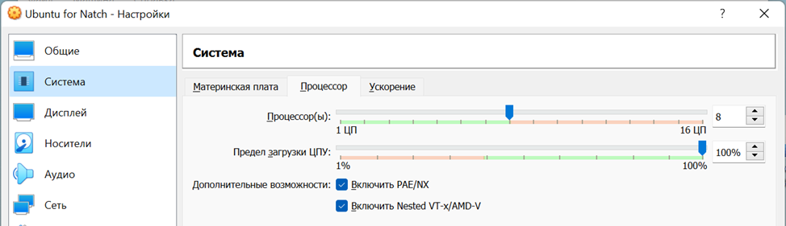
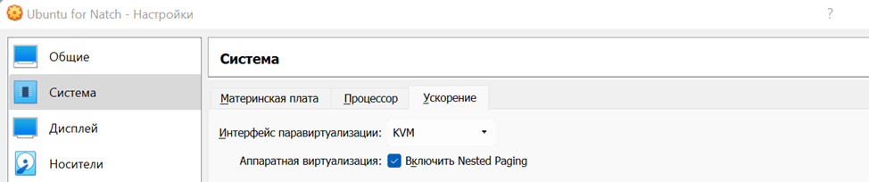
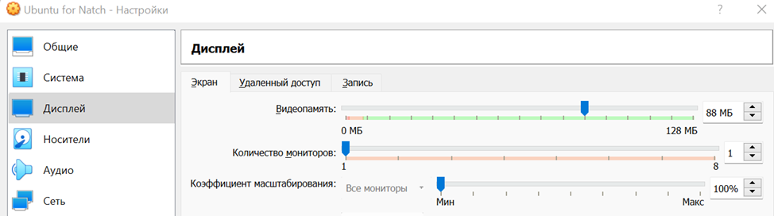

<a name="setup_env"></a>

# Настройка окружения для работы с Natch

В этом разделе описаны подготовительные действия, которые могут потребоваться перед работой с *Natch*.

Если ваша хостовая ОС не входит в [список поддерживаемых инструментом систем](3_setup.md#complect) или
вы хотите работать с *Natch* в изолированной среде, то необходимо подготовить окружение.

В случае, если дистрибутив для вашей системы выпускается, и вы готовы работать с *Natch* в своей системе,
переходите к разделу [Установка и настройка Natch](3_setup.md#setup_natch).


## Пример окружения

Рассмотрим пример создания изолированной среды со следующим стеком:

* хостовая ОС Ubuntu24
* VirtualBox 7.0.16
* гостевая ОС Ubuntu24

При создании виртуaльной машины следует выделить максимально допустимое для вас количество оперативной памяти,
также имейте в виду, что трассы *Natch* объемны, поэтому размер жесткого диска тоже должен быть большим
(размер сильно зависит от исследуемого ПО, чем сложнее и длиннее сценарии, тем больше потребуется дискового пространства).

После установки ОС, систему необходимо выключить и донастроить в интерфейсе VirtualBox.
Эти настройки нужны для использования возможностей аппаратной виртуализации:





<figcaption>_Настройки машины в VBox_</figcaption>

В целом, это все. Теперь у вас есть система, поддерживаемая инструментом *Natch*, и можно
[установить *Natch*](3_setup.md#setup_natch) и переходить к [подготовке образа с вашим программным продуктом](6_prepare_image.md#prepare_image).


## Требования и рекомендации

Важным условием выбора инструментов виртуализации и ОС является возможность запуска эмулятора QEMU в режиме аппаратной
виртуализации (ключ `-enable-kvm`). Скорость работы в режиме аппаратной виртуализации более чем на порядок
превосходит работу в режиме полносистемной эмуляции.

Например, в случае с VirtualBox, устройство `/dev/kvm` внутри Ubuntu появится только после того, как вы успешно пробросите
виртуализацию из вашей ОС внутрь виртуальной машины (через интерфейс VirtualBox). Если этого не сделать, ядро Ubuntu не сможет
инициализировать модуль KVM, и файла `/dev/kvm` в системе не будет.

Проверить доступность данного режима в вашей хостовой системе можно с помощью команды:

```bash
sudo kvm-ok
```

Если вы получили ответ:

```bash
INFO: dev/kvm exists
KVM acceleration can be used
```

Значит виртуализация проброшена и эмулятор будет работать быстро.

Также важно проверить поддерживает ли виртуализацию ваш процессор:

```bash
egrep -c '(vmx|svm)' /proc/cpuinfo
```

В результате будут следующие варианты ответа системы:

 - 0 -- процессор не поддерживает функции KVM
 - 1 и более -- процессор поддерживает функции KVM


Также некоторые дополнительные материалы и настройки Ubuntu можно посмотреть в [статье](https://phoenixnap.com/kb/ubuntu-install-kvm).

