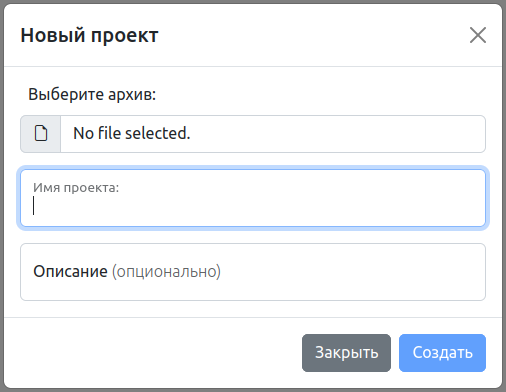
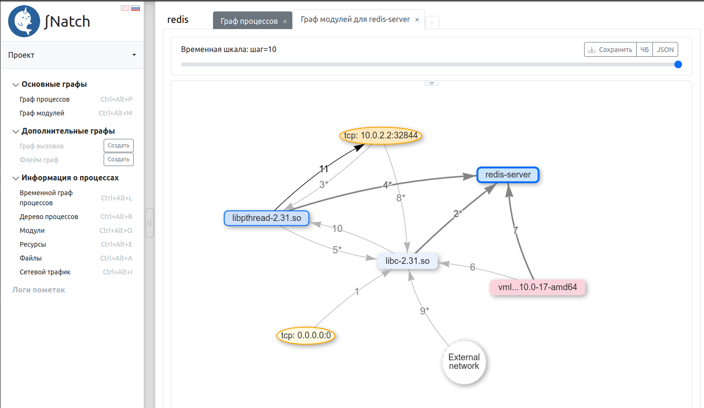
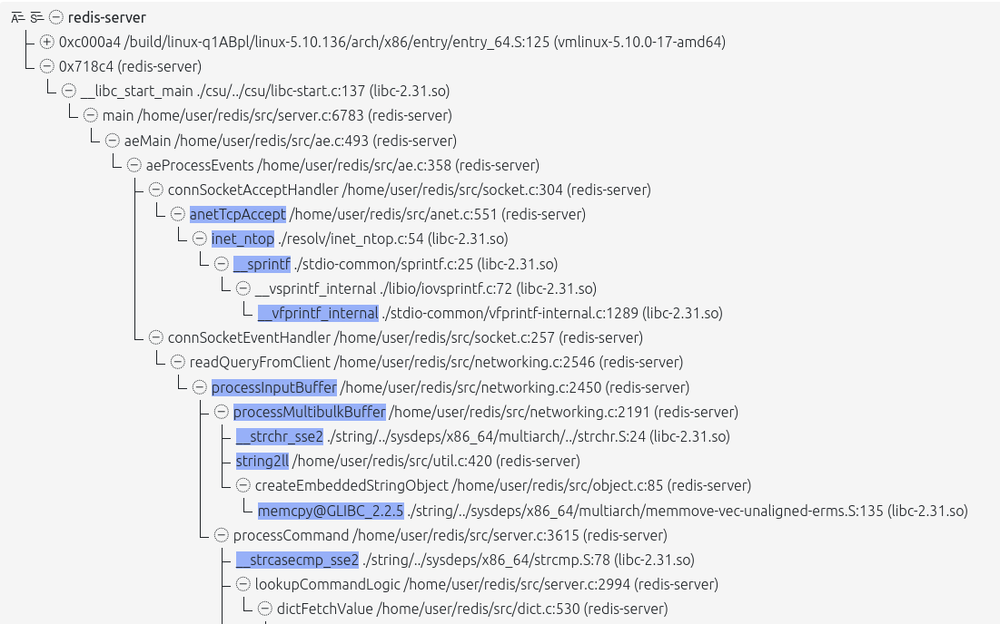

<div style="page-break-before:always;">
</div>

# <a name="natch_stepbystep"></a>4. Запуск тестовых примеров Natch

В этом разделе представлен пошаговый разбор работы с тестовыми примерами *Natch*,
а так же немного затронут инструмент *SNatch*
(подробности в разделе [Анализ поверхности атаки с помощью SNatch](9_snatch.md#snatch)).

Для работы с инструментом *Natch* нужны входные данные, а именно, подготовленный образ системы с собранным в нем объектом оценки, а так же бинарные файлы самого объекта оценки.
Чтобы быстро попробовать *Natch*, разработчики подготовили образ и несколько примеров, на которых можно поэкспериментировать без лишних трудозатрат.

Предполагается, что *Natch* и зависимости уже установлены в системе, но если это не так, перейдите в раздел [Установка и настройка Natch](2_setup.md#setup_natch).

Нижеописанные действия были проделаны на примере хостовой ОС Ubuntu 20.


## <a name="test_suite">4.1. Получение образа и тестовых примеров

Подготовленный разработчиками [тестовый набор](https://nextcloud.ispras.ru/index.php/s/testing_natch) включает в себя минимизированный образ гостевой операционной системы Debian
(размер qcow2-образа около 1 ГБ), а также два комплекта программ (Sample1_bins и Sample2_bins), собранных с отладочными символами.
Помимо этого, в тестовом наборе находится ряд скриптов, которые не пригодятся нам в этом разделе, но будут нужны для автоматизации выполнения сценариев,
подробнее можно ознакомиться в разделе [Автоматизированное выполнение](11_automation.md#automation).

Команда для скачивания тестового комплекта с помощью *curl* выглядит так:
```bash
curl -o materials.zip 'https://nextcloud.ispras.ru/index.php/s/testing_natch/download'
```

После скачивания обучающих материалов их следует распаковать.

Образ гостевой ОС находится в папке `Natch_testing_materials`. Учётные записи пользователей: `user/user` и `root/root`.


**Сценарий использования тестового комплекта Sample1_bins**

Программа `test_sample` читает файл *sample.txt*, в первой строке которого записан адрес Google. Он передает эту строку в качестве параметра программе `test_sample_2`.
Программа `test_sample_2` "курлит гугл" в файл *curl.txt*.
В образе исполняемые файлы находятся в папке `/home/user/Sample1`, там же расположены и исходные коды.

Запуск тестового сценария:
```bash
cd Sample1
./test_sample
```

**Сценарий использования тестового комплекта Sample2_bins**

В ходе сценария необходимо запустить `redis-server` внутри виртуальной машины, в хостовой же системе запустить клиент `redis-cli` и отправить на сервер несколько запросов.

Команда для запуска `redis-server`:

```bash
redis-server --port 5555 --protected-mode no
```

Команда запуска клиентской улититы:

```bash
redis-cli -h localhost -p 49152
```

Утилиту `redis-cli` можно поставить в вашу систему (`sudo apt install redis-tools`), либо воспользоваться бинарным файлом `redis-cli` из тестового набора
(необходимо будет выставить права на исполнение).

Далее выполнить какие-нибудь действия, например `SET b VeryBigValue`, `GET b`.

В тестовом образе redis установлен в систему.


## <a name="config_natch_test_image"></a>4.2. Создание проекта для работы с тестовым образом

Все основные функции *Natch* доступны через команду `natch` в командной строке. Запуск этой команды без параметров
отобразит справочную информацию о версии и доступных действиях:

```
Natch_v.3.2
Copyright (c) 2020-2024 ISP RAS

based on QEMU emulator v.7.2.0
Copyright (c) 2003-2022 Fabrice Bellard and the QEMU Project developers

Available builds: x86_64, aarch64

optional arguments:
  -h, --help            show this help message and exit
  -v, --version         Natch version

main commands:
  {create,cr,record,replay,kvm,tuning,info,delete,edit,set,modules,settings}
                        use <cmd_name> -h/--help for additional information
    create (cr)         create project
    record              record scenario (only for project)
    replay              replay scenario (only for project)
    kvm                 launch QEMU kvm without Natch (only for x86_64)
    tuning              launch tuning (only for project)
    info                info about project (only for project)
    delete              delete scenario (only for project)
    edit                edit Natch config files (only for project)
    coverage            get coverage for code (only for project)
    set                 change some project settings (only for project)
    modules             add/update/copy modules in the project (requires sudo)
    settings            Natch shell settings
```

Подробно [командный интерфейс Natch](3_natch_cmd.md#natch_cmd) описан в соответствуюшем разделе.

Работа с тестовыми примерами *Natch* начинается с создания проекта (рабочей директории).
Помимо этого, процесс настройки созданного проекта может включать ручной этап, который предполагает внесение изменений в
конфигурационные файлы проекта.
Предназначение файлов конфигурации и их параметров описано в разделе [Конфигурационные файлы Natch](17_app_configs.md#app_configs).

### 4.2.1. Создание проекта

Создание проекта выполняется командой `natch create` (подробнее в разделе [Создание проекта](6_create_project.md#create_project)),
которая имеет два обязательных параметра -- название будущего проекта и путь к образу исследуемой системы.
В процессе выполнения команды будет задан ряд вопросов. Запустим ее:

```text
user@natch1:~/natch_quickstart$ natch create test1 Natch_testing_materials/test_image_debian.qcow2

Directory for project files /home/user/natch_quickstart/test1 was created
OS: Linux

Image: /home/user/natch_quickstart/Natch_testing_materials/test_image_debian.qcow2

-> Attention! To create a project you will need a root password
```

Команда выдаст предупреждение о том, что в процессе настройки потребуется пароль администратора.

Далее будет проверено наличие, а так же доступность утилиты `natch-qemu-img`,
которая потребуется в дальнейшей настройке и работе. В случае успеха увидим:
```text
Checking natch-qemu-img utility...
Utility natch-qemu-img is ok
```
Если что-то пошло не так, создание проекта будет прервано.

Для поиска исполняемых модулей, скачивания отладочной информации и некоторых других файлов потребуется
монтировать образ. Однако, от этой опции можно отказаться, в этом случае часть функционала будет недоступна.

```text
-> Attention! Some options need to mount your image
Do you agree to mount image? [Y/n] y
```

Укажите сколько памяти выдать гостевой виртуальной машине (постфикс указывать обязательно. G или M):
```text
Common options
Enter RAM size with suffix G or M (e.g. 4G or 256M): 4G
```
Далее можно выбрать режим работы эмулятора -- графический, текстовый или vnc. По умолчанию графический.
```text
Select mode you want to run emulator: graphic [G/g] (default), text [T/t] or vnc [V/v] g
```

Если сценарий предполагает передачу помеченных данных по сети (далее мы рассматриваем в качестве основного как раз сценарий №2 --
взаимодействие с redis-сервером, слушающим tcp-порт 5555), нам потребуется взаимодействовать с сетевыми сервисами гостевой ОС с помощью программ,
запущенных на хосте. Указываем *Natch*, какой порт мы хотим пробросить в гостевую ОС:

```text
Network option
Do you want to use ports forwarding? [Y/n] y
Do you want to taint source ports too? [Y/n] n
Write the ports you want separated by commas (e.g. 7777, 8888, etc) 5555
Your pair of ports for connecting: 5555 <=> 49152
```

Далее последует ряд вопросов, реакция на которые будет не сразу. Произойдет сбор сведений, а затем
наступит автоматическая фаза, где в соответствии с выбранными характеристиками будут происходить действия.

Первый из вопросов касается конфигурационного файла для модулей. Согласимся на его создание и
нам нужно будет указать путь к каталогу на хосте, содержащем копии бинарных файлов, размещенных в гостевой ОС.
Находятся они в папках `Sample1_bins` и `Sample2_bins` в тестовых материалах.
Так как будет проделан пример с `redis`, то следует указать путь к папке `Sample2_bins`.
Если для другого вашего сценария бинарные файлы отсутствуют, можно отказаться создавать конфигурационный файл модулей.

**Обновление!** С версии 3.2 можно указывать путь к модулям в гостевой системе, таким образом, можно заранее не выкачивать
бинарные файлы в хостовую систему, но только если было дано согласие на монтирование образа.

```text
Modules part
Do you want to create module config? [Y/n] y
Select way to point directory with modules - from HOST [H/h] system (default) or GUEST [G/g] system: h
Enter path to binaries dir (or 'exit' to skip): /home/user/natch_quickstart/Natch_testing_materials/Sample2_bins
```

Затем будет предложено скачать отладочные символы для системных модулей. Соглашаемся, так следует поступать в
большинстве случаев. В версии 3.2 появляется дополнительный вопрос, предлагающий использовать расширенные настройки
поиска и скачивания отладочной информации. Откажемся.

```text
Debug info part
Do you want to get debug info for system modules? [Y/n] y
Do you want to set additional parameters? (many questions) [y/N] n
```

Финальный вопрос касается генерации конфигурационного файла, содержащего смещения структур ядра исследуемой ОС.
Этот файл необходим для работы инструмента, и ранее сгенерированного у нас нет, так что соглашаемся.

```text
Generate config file task.cfg? (recommended) [Y/n] y
```

Последнее, что надо ввести пользователю -- пароль администратора.

Дальнейшие действия выполняются автоматически, процесс может занять продолжительное время.
На этом этапе произойдет монтирование образа, поиск системных библиотек и интерпретаторов,
скачивание отладочной информации для них. Затем будет формироваться конфигурационный файл `task.cfg`,
для чего потребуется запуск эмулятора. Последним этапом будет формирование базы символов для
всех модулей из конфигурационного файла `module.cfg`.

Все это время в консоль будут выводиться сообщения примерно следующего вида:

```text
────────────────────────────── Module Configuration Section ───────────────────────────────────────

Mounting Image - OK

[Parsing received folder...]
Status: Found: 2

[Searching Host Images In Guest OS...]
Status: Found: 2

[Searching Debugging Information...]
Status: Found: 0 | Skipped: 2

USER statistics:
Images have been found                                            :     OK
Added images                                                      :     2
Added debugging information                                       :     0
Added tied information                                            :     0


ld-linux-* is always skipped and isn't counted in calculations
Your config file module.cfg was created
Umounting Image - OK
Mounting Image - OK

─────────────────────────────── Libraries Searching Section ───────────────────────────────────────

>>> Host Config Section >>>

[Reading Module Config...]
Status: Found: 2

>>> Additional Section >>>

[Searching Python, Java, C# Symbols...]
Status: Found: 47


─────────────────────────────────────────── OS ────────────────────────────────────────────────────
───────────────────────────── Library-Debug Matching Section ──────────────────────────────────────

────────────────────────────── Searching Additional Symbols ───────────────────────────────────────
>>> Shared Libraries Section >>>

[Searching Shared Libraries For...]
Progress:    ━━━━━━━━━━━━━━━━━━━━━━━━━━━━━━━━━━━━━━╺━ 46/48  96% 0:00:03
Status: Found: 46 | Skipped: 2

[Preparing Found Shared Libraries...]
Progress:    ━━━━━━━━━━━━━━━━━━━━━━━━━━━━━━━━━━━━━━━━ 31/31 100% 0:00:00
Status: Found: 31

>>> Kernel Section >>>

[Searching Kernel Symbols...]
Status: Found: 1
──────────────────────────────────── Debugging Symbols ────────────────────────────────────────────
>>> Method [1/2]: Default System Location Analysis >>>

[Searching Debugging Information...]
Progress:    ━━━━━━━━━━━━━━━━━━━━━━━━━━━━━━━━━━━━━━━━  0/78   0% 0:00:00
Status: Found: 0 | Skipped: 78
WARNING: Folder '/mnt/point3788669/usr/lib/debug' does not exist!
Default System Location Analysis method was skipped!
>>> Method [2/2]: DebugInfoD >>>
Checking available DebugInfoD servers - OK

[Searching Debugging Information...]
Progress:    ━━━━━━━━━━━━━━━━━━━━━━━━━━━━━━━━━━━━━━╺━ 75/78  96% 0:05:32
Response:    ━━━━━━━━━━━━━━━━━━━━━━━━━━━━━━━━━━━━━━━━ 78/78 100% 0:05:32
Status: Found: 75 | Skipped: 3
───────────────────────────────────── Tieddebug Symbols ───────────────────────────────────────────

>>> Method [1/1]: DebugInfoD >>>
Checking available DebugInfoD servers - OK

[Searching Tieddebug Information...]
Progress:    ━━━━━━━━━━━━━━━━━━━━━━━━━━━━━━━━━━━━━━━━ 0/1   0% 0:00:01
Response:    ━━━━━━━━━━━━━━━━━━━━━━━━━━━━━━━━━━━━━━━━ 1/1 100% 0:00:01
Status: Found: 0 | Skipped: 1

────────────────────────────────────────── DOCKER ─────────────────────────────────────────────────

WARNING: Docker not found at path: /mnt/point3788669/var/lib/docker! DOCKER analysis will be skipped!


────────────────────────────────────── ROOT_PODMAN ────────────────────────────────────────────────


WARNING: Podman not found at path: /mnt/point3788669/var/lib/containers/! ROOT_PODMAN analysis will be skipped!


──────────────────────────────── Removing Non-OS Images ───────────────────────────────────────────


──────────────────────────────── Clear Resources Section ──────────────────────────────────────────

Umounting Image - OK
───────────────────────────────────── Result Section ──────────────────────────────────────────────

HOST statistics:
Images have been found                                            :     OK
Added images                                                      :     2
Added debugging information                                       :     0
Added tied information                                            :     0

KERNEL statistics:
Images have been found                                            :     OK
Added images                                                      :     1
Added debugging information for kernel                            :     1

PYTHON statistics:
Images have been found                                            :     OK
Added images                                                      :     46
Added debugging information                                       :     46
Added tied information                                            :     0

SHARED_LIBRARY statistics:
Images have been found                                            :     OK
Added images                                                      :     31
Added debugging information                                       :     31
Added tied information                                            :     2
ld-linux-* is always skipped and isn't counted in calculations

Your config file '/home/user/natch_quickstart/test1/module.cfg' was updated

Tuning process will be started soon. Please, do not close the emulator
Three...
Two..
One.
Go!
Natch monitor - type 'help' for more information
(natch)
Natch v.3.1
(c) 2020-2024 ISP RAS

Reading Natch config file...
[Tasks] No such file 'task.cfg'. It will be created.
Checking config file '/home/user/natch_quickstart/test1/module.cfg'...
Now tuning will be launched.

Tuning started. Please wait a little...
Generating config file: task.cfg
Trying to find 8 kernel-specific parameters
[01/08] Parameter - task, files and mm struct   : Found
[02/08] Parameter - args                        : Found
[03/08] Parameter - mount                       : Found
[05/08] Parameter - f_count                     : Found
[05/08] Parameter - exit_state                  : Found
[06/08] Parameter - file read position          : Found
[07/08] Parameter - socket                      : Found
[08/08] Parameter - uid                         : Found

Detected 8 of 8 kernel-specific parameters. Creating config file...

Tuning completed successfully!

Symbol info part
Reading symbols for loaded modules

Created symbol database for /home/user/natch_quickstart/Natch_testing_materials/Sample2_bins/redis-server
Created symbol database for /home/user/natch_quickstart/Natch_testing_materials/Sample2_bins/redis-cli
...
...
Created symbol database for /home/user/natch_quickstart/test1/libs/src/f902f8a561c3abdb9c8d8c859d4243bd8c3f928f/python3.9
Created symbol database for /home/user/natch_quickstart/test1/libs/src/cc89a8838df3652561ab61598035775fa95f8917/vmlinux-5.10.0-17-amd64
Created symbol database for /home/user/natch_quickstart/test1/libs/src/5018237bbf012b4094027fd0b96fc22a24496ea4/libpthread-2.31.so
Created symbol database for /home/user/natch_quickstart/test1/libs/src/e9d2c06479b13dd3cfa78d714d11dccf6fcbee51/libm-2.31.so
Created symbol database for /home/user/natch_quickstart/test1/libs/src/bc22349819818055008048f8001e3910ffc16dc7/libexpat.so.1.6.12
Created symbol database for /home/user/natch_quickstart/test1/libs/src/a89a9c8e4a828f47e68e2d1dafca4aae087d061d/libz.so.1.2.11
Created symbol database for /home/user/natch_quickstart/test1/libs/src/5675f6cc697d1e1fb135c65cbb0f917550fe85ac/libutil-2.31.so
Created symbol database for /home/user/natch_quickstart/test1/libs/src/118b90161526d181807818c459baee841993795b/libdl-2.31.so
Created symbol database for /home/user/natch_quickstart/test1/libs/src/2e5abcee94f3bcbed7bba094f341070a2585a2ba/libc-2.31.so

Your config file '/home/user/natch_quickstart/test1/module.cfg' for modules was updated
```

Cоздание проекта завершено успешно, всё готово к записи сценария:

```text
Configuration file natch.cfg was created.
You can edit it before using Natch.

Settings completed! Now you can launch Natch and enjoy! :)


File 'settings_test1.ini' was saved here: /home/user/natch_quickstart/
You can use it for creating other projects

Checking the project's completeness...
/home/user/natch_quickstart/test1/natch.cfg                 +
/home/user/natch_quickstart/test1/qemu_opts.ini             +
/home/user/natch_quickstart/test1/service_info.ini          +
/home/user/natch_quickstart/test1/module.cfg                +
Everything is fine!
```

В папке проекта появится конфигурационный файл `natch.cfg`, содержащий общие настройки проекта, которые можно редактировать,
кроме того после записи сценария появится (в соответствующей папке) еще один конфигурационный файл `taint.cfg`,
который тоже можно редактировать. Также в папке проекта находится файл `natch.log`, содержащий журнал происходивших событий.

Кроме того, в месте запуска команды `natch create` сохранится файл `settings_test1.ini`, который можно будет использовать для
полностью автоматического создания проекта-клона, либо файл можно отредактировать и создать проект с нужными
характеристиками. Подробнее в разделе [Создание проекта с помощью конфигурационного файла](6_create_project.md#natch_save_settings).


## <a name="record_scenario"></a>4.3. Запись сценария работы

Можно переходить к записи сценария. Рассмотрим в качестве примера сценарий с redis-сервером (Sample2_bins).
Для записи сценария нужно перейти в рабочую директорию и запустить команду `natch record <name>`.

```bash
user@natch1:~/natch_quickstart/test1$ natch record sample_redis
```
В результате запустится эмулятор.

Введём логин и пароль учетной записи пользователя -- `user/user` и запустим redis-сервер:
```
redis-server --port 5555 --protected-mode no
```

Cоединимся с ним из хостовой ОС чтобы убедиться, что система работает как надо:
```text
user@natch1:~/natch_quickstart$ redis-cli -h localhost -p 49152

localhost:49152> select 0
OK
localhost:49152> set a b
OK
localhost:49152> get a
"b"
localhost:49152> exit
```
**Важное замечание**: *весь записываемый сценарий включает в себя и этап загрузки ОС, но помеченные данные появятся практически в самом конце,
когда мы обратимся к redis-серверу. Соответственно, для существенного сокращения времени на сбор данных (последующее выполнение `natch replay`)
нам необходимо сделать снапшот в точке, максимально приближенной к началу поступления помеченных данных в системе. То есть сейчас, когда от порождения
помеченных данных нас отделяет повторная отправка в redis уже знакомых нам команд*.

Нажмем `Ctrl+Alt+G`, выйдем в монитор QEMU (bash-терминал хостовой ОС в котором мы запустили `natch record`) и выполним команду генерации снапшота:
```
savevm <name>
```

Используем имя `ready`. Сохранение состояния займёт несколько секунд, в зависимости от размера образа и производительности компьютера в целом.
```text
user@natch1:~/natch_quickstart/test1$ natch record sample_redis
Natch monitor - type 'help' for more information
(natch)
Natch v.3.1
(c) 2020-2024 ISP RAS

Reading Natch config file...
Network logging enabled
Config is loaded.
You can make system snapshots with the command: savevm <snapshot_name>
Network pcap log file: "/home/user/natch_quickstart/test1/sample_redis/network.pcap"
Network json log file: "/home/user/natch_quickstart/test1/sample_redis/network.json"

(natch) savevm ready
(natch)
```

После того как снапшот был сгенерирован, снова отправим какие-нибудь данные из хостовой ОС в redis-сервер. Теперь завершим работу QEMU, закрыв графическое окно эмулятора.

Сценарий работы с `redis` записан.

Теперь в папке с нашим проектом (`test1`) появилась директория с названием сценария `sample_redis`. В ней размещены логи сетевых операций, файл журнала, оверлей диска,
и, самое главное для пользователя -- [конфигурационный файл помеченных данных](17_app_configs.md#taint_config) `taint.cfg`. На данный момент все настройки по умолчанию нам подходят.

Для каждого вновь записанного сценария будет появляться своя папка с индивидуальными настройками.

Настройки можно редактировать с помощью команды `natch edit taint`, где будет предложено выбрать нужный сценарий.

## <a name="replay_scenario"></a>4.4. Воспроизведение сценария и сбор данных для анализа

Для воспроизведения нужно выполнить команду `natch replay`.
```text
user@natch1:~/natch_quickstart/test1/$ natch replay
```
Команда может принимать два параметра: название сценария и имя снапшота. В нашем случае команда могла бы выглядеть так:
```text
user@natch1:~/natch_quickstar/test1/$ natch replay sample_redis ready
```
Если используются параметры, то они оба являются обязательными. Однако, запускать replay можно без параметров, он сам или загрузит нужный сценарий (если он единственный)
или предложит выбрать из списка существующих, точно так же произойдет с выбором снапшота.

Начнём воспроизведение сценария, а точнее его фрагмента, который выполнялся после создания снапшота. Это будет несколько медленнее, чем базовое выполнение.

Через какое-то время выполнение сценария завершится, графическое окно закроется, и вы увидите сообщение наподобие приведённого ниже, свидетельствующее о том,
что интересующие нас модули гостевой ОС были распознаны успешно, и, следовательно, мы получим в отчетах корректную символьную информацию.
```text
Snapshot to load: ready
Natch monitor - type 'help' for more information
(natch)
Natch v.3.1
(c) 2020-2024 ISP RAS

Reading Natch config file...
Network logging enabled
Task graph enabled
Module graph enabled
Taint enabled
Config is loaded.
File events binary log file /home/user/natch_quickstart/test1/output_sample_redis/files_b.log created successfully
Module binary log file /home/user/natch_quickstart/test1/output_sample_redis/log_m_b.log created successfully
Modules: started reading binaries
Modules: finished with 13 of 13 binaries for analysis
thread_monitor: identification method is set to a complex developed at isp approach
Started thread monitoring
Tasks: config file is open.
Process events binary log file /home/user/natch_quickstart/test1/output_sample_redis/log_p_b.log created successfully
Network json log file: "/home/user/natch_quickstart/test1/output_sample_redis/tnetwork.json"
Binary log file /home/user/natch_quickstart/test1/output_sample_redis/log_t_b.log created successfully
Binary call_stack log file /home/user/natch_quickstart/test1/output_sample_redis/log_cs_b.log created successfully
Detected module /home/user/natch_quickstart/test1/libs/src/cc89a8838df3652561ab61598035775fa95f8917/vmlinux-5.10.0-17-amd64 execution
Detected module /home/user/natch_quickstart/test1/libs/src/2e5abcee94f3bcbed7bba094f341070a2585a2ba/libc-2.31.so execution
Detected module /home/user/natch_quickstart/Natch_testing_materials/Sample2_bins/redis-server execution
Detected module /home/user/natch_quickstart/test1/libs/src/5018237bbf012b4094027fd0b96fc22a24496ea4/libpthread-2.31.so execution
Detected module /home/user/natch_quickstart/test1/libs/src/e9d2c06479b13dd3cfa78d714d11dccf6fcbee51/libm-2.31.so execution


=========== Statistics ===========

Tainted files             : 0
Tainted packets           : 147
Tainted processes         : 3
Tainted modules           : 3
Tainted file reads        : 0
Tainted memory accesses   : 21026

Compressing data. Please wait..

test1+sample_redis.tar.zst completed
```

Если работа системы завершилась успешно, и вы не поймали, например, `core dumped` (о чём стоит немедленно сообщить в [трекер](https://gitlab.ispras.ru/natch/natch-support/-/issues) с приложением всех артефактов),
можно переходить к анализу собранных данных.

После воспроизведения сценария в папке проекта появилась директория с выходными данными `output_sample_redis` и, главное, архив, который необходимо передать в графическую подсистему *SNatch*.
Название архива формируется следующим образом:` <название проекта>+<название сценария>.tar.zst`. Таким образом, записывая разные сценарии, уже готовые архивы не будут перезаписаны и могут быть
использованы повторно или переданы третьим лицам.

## <a name="snatch_analysis"></a>4.5. Анализ с использованием SNatch

*SNatch* -- это подсистема визуализации данных и статистик, собранных при воспроизведении сценария работы под управлением *Natch*.
*SNatch* реализован в формате веб-службы с браузерным интерфейсом просмотра.

В комплект поставки *SNatch* входят скрипты `snatch_start.sh` и `snatch_stop.sh` для запуска и остановки *SNatch* соответственно.
Скрипт `snatch_start.sh` запускает необходимые для работы службы, а также открывает браузер с интерфейсом.
В терминал, из которого был запущен скрипт, будут приходить сообщения от сервера, однако, он свободен для использования,
поэтому по окончании работы из него же можно запустить скрипт `snatch_stop.sh` для остановки служб.
Запускать `snatch_stop.sh` следует всегда, в противном случае процессы останутся висеть в памяти вашего компьютера до перезагрузки.

Полное руководство пользователя *SNatch* доступно в разделе [Анализ поверхности атаки с помощью SNatch](9_snatch.md#snatch), здесь же приведем краткий обзор некоторых аналитик.

Запустим *SNatch*:
```bash
user@natch1:~/natch_quickstart$ ./snatch/snatch_start.sh
```
Создадим проект на основе собранных данных (необходимо указывать tar.zst-архив, формируемый *Natch* в каталоге проекта по результатам выполнения `natch replay`):

<figcaption>_Создание SNatch проекта_</figcaption>

Через некоторое время процесс загрузки архива завершится и станут доступны различные виды аналитик (*их число и возможности постоянно нарастают*).

Главное окно представляет динамическую визуализацию распространения помеченных данных.
Ярким цветом на каждом шаге *Временной шкалы* выделяются сущности, взаимодействующие на данном конкретном шаге.

Кликнув по процессу *redis-server* мы увидим боковую панель с информацией об этом процессе.

<figcaption>_Интерфейс *SNatch*_</figcaption>

На боковой панели так же находится кнопка для перехода на граф модулей, связанных с выбранным процессом.
На рисунке ниже представлен граф модулей для процесса `redis-server`.

<figcaption>_Модуль граф для redis-server_</figcaption>

Для просмотра таких аналитик, как граф вызовов и флейм граф, следует их предварительно сгенерировать, нажав на соответствующие кнопки *Создать*.

Фрагмент графа вызовов для примера с redis-server представлен на рисунке ниже. Голубым цветом выделены функции, работавшие с помеченными данными.

<figcaption>_Граф вызовов_</figcaption>

Подробнее о возможностях *SNatch* написано в разделе [Анализ поверхности атаки с помощью SNatch](9_snatch.md#snatch).

## 4.6. Просмотр сетевого трафика в Wireshark

Анализировать трафик в Wireshark можно прямо из интерфейса *SNatch* с помощью раздела *Сетевой трафик*. Здесь можно увидеть интерфейсы и сессии, клик по каждой записи будет открывать Wireshark с соответствующими данными.

<figcaption>_Информация о трафике_</figcaption>

Так же можно открывать только помеченный трафик, трафик, относящийся к сценарию, а так же весь трафик с помощью соответствующих кнопок.

<figcaption>_Исследование трафика в Wireshark_</figcaption>

## 4.7. Изменение настроек проекта

В рассмотренном сценарии нам не пришлось изменять конфигурационный файл сценария, потому что порт был установлен при настройке проекта. Однако, это может потребоваться.
Конфигурационный файл `taint.cfg` находится в папке со сценарием и содержит следующие секции: *Taint*, *Ports*, *TaintFile*, *USB*, *FunctionArgs*.
Появляется папка со сценарием, как мы уже знаем, после записи сценария.

Попробуем записать сценарий для первого тестового примера. Запустим уже знакомую команду `natch record sample_test`, дождемся загрузки ОС.
Для выполнения сценария следует перейти в папку `Sample1`, на этом моменте не забыть сохранить состояние машины `savevm ready`, вернуться в эмулятор и
запустить программу `./test_sample`.
Дожидаемся завершения программы и работу эмулятора можно завершать.

После того как сценарий записан, следует указать источник пометки. Это можно сделать с помощью команды `natch edit taint`. Выберем сценарий `sample_test` и внесем изменения
в файл конфигурации.

Пометить файл *sample.txt* нужно следующим образом:

```ini
[TaintFile]
list=sample.txt
```
Так же мы увидим, что в наследство от первоначальной настройки остался выбранный порт. В этом сценарии отслеживание сети не требуется, закомментируем секцию *Ports* полностью.

Казалось бы все готово к воспроизведению сценария, но при первоначальной настройке мы указывали путь только к `Sample2_bins`, значит `module.cfg` ничего не знает про бинарные файлы для
первого тестового сценария. Просто руками дописать их в конфигурационный файл не сработает, потому что необходимо еще собрать отладочную информацию для системных
библиотек, от которых зависят бинарные файлы, а так же построить символьную информацию. Потребуется запуск специальной команды `natch modules add <dir>`.

Потребуется указать путь к папке с новыми модулями.

Сейчас `module.cfg` содержит 80 записей. Выполним команду:
```
user@natch1:~/natch_quickstart/test1$ natch modules add ../Natch_testing_materials/Sample1_bins
```

Для монтирования образа будет запрошен пароль администратора. Затем будут происходить действия, которые вы уже видели при первоначальной настройке проекта.

После того как команда отработала, мы увидим что записей в конфигурационном файле стало 82. Никаких новых системных библиотек не добавилось, только бинарные файлы нашего примера.

Теперь все готово, выполним `natch replay` без параметров и увидим, что нам предлагают выбрать из двух вариантов. Выбираем `sample_test`. И снова выбор, теперь снапшота. Выбираем `ready`.

После того как эмулятор отработает увидим следующую статистику:
```
============ Statistics ============

Tainted files             : 1
Tainted packets           : 0
Tainted processes         : 9
Tainted modules           : 16
Tainted file reads        : 1
Tainted memory accesses   : 2275

```
Так же в папке с проектом появится новая директория `output_sample_test` и архив `test1+sample_test.tar.zst`.

Помимо команды для добавления модулей в конфигурационный файл, существует еще возможность обновить содержимое `module.cfg` (команда `natch modules update`).
Кроме того, можно внести некоторые изменения в настройки проекта, используя группу команд `natch change`.

Ознакомиться с подробным описанием возможностей команды `natch` можно в разделе [Командный интерфейс Natch](3_natch_cmd.md#natch_cmd).

