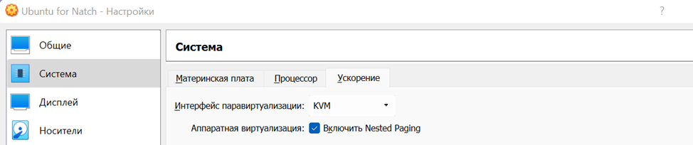

<div style="page-break-before:always;">
</div>

# <a name="setup_env"></a>5. Настройка окружения для работы с Natch

Работа с *Natch* предполагает подготовку образа операционной системы для [QEMU](https://wiki.qemu.org/Main_Page).

В этом разделе описаны все подготовительные действия, которые могут потребоваться перед работой непосредственно с инструментом.

## <a name="create-qemu-env"></a>5.1. Подготовка виртуализованной среды в формате QEMU

Подготовка виртуализованной среды выполнения ОО в общем случае состоит из следующих последовательных шагов:

* создание образа эмулируемой операционной системы в формате диска [qcow2](https://en.wikipedia.org/wiki/Qcow) на основе базового дистрибутива ОС. Формат *qcow2* позволяет эффективно формировать снапшоты состояния файловой системы в произвольный момент выполнения виртулизованной среды функционирования;
* сборка дистрибутива ОО с требуемыми параметрами, в частности, с генерацией и сохранением отладочных символов;
* помещение собранного дистрибутива ОО в виртуализованную среду выполнения;
* подготовка команд запуска QEMU, для эмуляции аппаратной части среды функционирования, загрузку и выполнение компонентов *Natch*.

Подготовка виртуализованной среды выполнения ОО в значительной степени совпадает с подготовкой среды для анализа с помощью инструмента динамического анализа помеченных данных [Блесна](https://www.ispras.ru/technologies/blesna/) (разработчик - [ИСП РАН](https://www.ispras.ru/)), с точностью до подготовки команд запуска QEMU.

Создавать виртуализованную среду выполнения ОО рекомендуется в хостовой системе, допускающей запуск QEMU в режиме пользовательской виртуализации (ключ `-enable-kvm`) - это существенно ускорит процесс,
скорость работы в режиме аппаратной виртуализации более чем на порядок превосходит работу в режиме полносистемной эмуляции. Проверить доступность данного режима в вашей хостовой системе
(равно как и установить KVM-модули в вашу систему) можно, опираясь на следующую [статью](https://phoenixnap.com/kb/ubuntu-install-kvm), с помощью команды:
```bash
sudo kvm-ok
```

Примерный алгоритм проброса виртуализации для трехуровневого стенда: *Windows 11+AMD Процессор (хостовая ОС  рабочей станции) -> VirtualBox (хостовая ОС рабочей станции) -> ubuntu+kvm+qemu (хостовая ОС Natch) -> lubuntu (гостевая ОС)* приведён ниже.

Перед установкой KVM в гостевой ОС нужно настроить среду виртуализации VirtualBox в хостовой ОС как на рисунках ниже.

____
**ВНИМАНИЕ!**

На момент 12.02.2024 по-прежнему наблюдается проблема с тем, что VirtualBox версии 7+ (7.0.8) не позволяет корректно запускать QEMU в режиме поддержки KVM. Используйте VirtualBox версии 6.1.40 (именно эту). Наиболее актуальный тикет на данную ошибку заведён [здесь](https://www.virtualbox.org/ticket/21552), пока что без ответа.




<figcaption>_Настройки машины в VBox_</figcaption>

Перед установкой KVM необходимо определить, поддерживает ли процессор эту функцию:
```bash
egrep -c '(vmx|svm)' /proc/cpuinfo
```

В результате будут следующие варианты ответа системы:

 - 0 – процессор не поддерживает функции KVM;
 - 1 и более – процессор поддерживает функции KVM.

Следующий этап – установка KVM:
```bash
sudo apt install qemu qemu-kvm libvirt-daemon libvirt-clients bridge-utils virt-manager
```
Этой командой будет выполнена установка утилиты `kvm`, библиотеки `libvirt` и менеджера виртуальных машин.

Далее необходимо добавить своего пользователя в группу `libvirt`, так как только `root` и пользователи этой группы могут использовать виртуальные машины KVM:
```bash
sudo gpasswd -a $USER libvirt
```

Затем необходимо убедиться, что сервис `libvirt` запущен и работает:
```bash
sudo systemctl status libvirtd
```

После выполнения этой команды выполнить: `reboot`

Далее, проверка установки `kvm`: `kvm-ok`

Если вы получили ответ:

```bash
INFO: dev/kvm exists
KVM acceleration can be used
```

Значит настройка выполнена правильно, и вы молодец :) Ваша QEMU-виртуализированная гостевая ОС будет работать быстро, что позволит быстро сформировать в ней исследуемую среду.

При этом важно помнить, что анализ в любом случае необходимо выполнять без использования данного ключа, так как только полносистемная эмуляция позволяет собрать полный лог действий процессора.

### 5.1.1. Подготовка хостовой системы

Требования к хостовой системе приведены в разделе [Требования и ограничения Natch](22_app_requirements.md#app_requirements).

Подготовим Linux-based рабочую станцию (далее - хост), поддерживающую графический режим выполнения. QEMU демонстрирует вывод эмулируемой среды выполнения в отдельном графическом окне, следовательно, нам необходим графический режим. Хост может быть реализован в формате виртуальной машины. В примерах ниже описаны действия пользователя, работающего в виртуальной машине VirtualBox (4 ядра, 8 ГБ ОЗУ)
с установленной ОС [Ubuntu20.04](ttps://releases.ubuntu.com/20.04/ubuntu-20.04.5-desktop-amd64.iso) (desktop-конфигурация, обновить пакеты при установке).

Установим требуемое системное ПО, в т.ч. QEMU:
```bash
sudo apt install -y curl qemu-system gcc g++
```
*Подсказка: данная инсталляция требуется не для запуска Natch, но для создания образов ВМ на произвольном хосте. Natch содержит в своём составе требуемую для работы версию QEMU, поэтому если вы планируете создавать образ ВМ на том же хосте, на котором уже установили Natch, отдельно QEMU можно не ставить.*

Скачаем на хост выбранный базовый дистрибутив ОС. Лучше использовать минимальный образ -- уменьшение числа установленных служб, стартующих при запуске, сокращает нагрузку на процессор и ускоряет анализ объекта оценки в режиме полносистемной эмуляции. В нашем примере используется легковесный образ Ubuntu - [lubuntu](https://lubuntu.net/downloads/). Создадим каталог на хосте и скачаем туда дистрибутив:
```bash
cd ~ && mkdir natch_quickstart && cd natch_quickstart
curl -o lubuntu-18.04-alternate-amd64.iso  'http://cdimage.ubuntu.com/lubuntu/releases/18.04/release/lubuntu-18.04-alternate-amd64.iso'
```
Проверим, работает ли эмулятор:
```bash
qemu-system-x86_64 --version
QEMU emulator version 4.2.1 (Debian 1:4.2-3ubuntu6.19)
Copyright (c) 2003-2019 Fabrice Bellard and the QEMU Project developers
```
Для установки гостевой ОС создадим образ жесткого диска в формате `qcow2`, с именем `lubuntu.qcow2` и размером `20 ГБайт`.
```bash
qemu-img create -f qcow2 lubuntu.qcow2 20G
Formatting 'lubuntu.qcow2', fmt=qcow2 size=21474836480 cluster_size=65536 lazy_refcounts=off refcount_bits=16
ll
total 8100768
drwxrwxr-x  4 user user       4096 янв 30 20:40 ./
drwxr-xr-x 25 user user       4096 янв 30 20:40 ../
-rw-rw-r--  1 user user  751828992 янв 30 20:34 lubuntu-18.04-alternate-amd64.iso
-rw-r--r--  1 user user     196928 янв 30 20:08 lubuntu.qcow2
```
Создадим скрипт запуска нашей ВМ `run.sh`. Мы сохраняем его в виде отдельного файла, потому что позже скрипт потребуется редактировать. Для тех, кто сталкивается с синтаксисом QEMU впервые, рекомендуется ознакомиться с основными командами, описанными в официальной [документации QEMU](https://www.qemu.org/docs/master/system/invocation.html). Важным для ускорения работы виртуализированной среды QEMU, за счет аппаратной [виртуализации](#create-qemu-env), является установка ключей `-enable-kvm` и `-cpu host,nx`.
```bash
qemu-system-x86_64 \
-hda lubuntu.qcow2 \
-m 4G \
-enable-kvm \
-cpu host,nx \
-monitor stdio \
-netdev user,id=net0 \
-device e1000,netdev=net0 \
-cdrom lubuntu-18.04-alternate-amd64.iso
```
Запустим скрипт:
```bash
./run.sh
```
после чего увидим графическое окно установки *lubuntu*. *lubuntu* желательно устанавливать с минимальным набором параметров для ускорения установки и уменьшения "шума" избыточных процессов и сетевых служб во время анализа.

*Подсказка: чтобы вывести курсор мыши из открытого графического окна ВМ QEMU нажмите Ctrl+Alt+G*

После завершения установки удалим из скрипта запуска `run.sh` указание подключения cdrom -- для дальнейшей работы он нам не потребуется
```bash
#-cdrom lubuntu-18.04.3-desktop-amd64.iso
```
Наш образ среды функционирования готов к работе, в частности, к установке в него пресобранного *с символами* прототипа объекта оценки.

### <a name="build_prototype"></a>5.1.2. Сборка прототипа объекта оценки

Рекомендации по подготовке исполняемого кода приведены в разделе [Рекомендации по подготовке объекта оценки](23_app_oo_preparation.md#app_preparation).

В общем случае к анализируемому исполняемому коду выставляется два требования:

* должна быть представлена отладочная информация в формате символов в составе исполняемых файлов, отдельно прилагаемых символов или map-файлов. Предоставление символов непосредственно в составе исполняемых файлов является основной и рекомендуемой стратегией. *Natch* умеет самостоятельно доставать информацию об отладочных символах из исполняемых файлов, собранных *как минимум* компиляторами *gcc* и *clang* с сохранением отладочной информации (ключ компилятора `-g`, также рекомендуется сборка без оптимизаций в режиме `-O0`). Для стандартных пакетов из наиболее популярных сборок операционных систем символы подгружаются автоматически;
* рекомендуется выполнять сборку подлежащего анализу исполняемого кода в виртуализированной среде (виртульная машина QEMU). В случае, если сборка и анализ будут выполняться в различных средах функционирования (например, сборка осуществляется на отдельном сборочном сервере), требуется обеспечить совместимость версий разделяемых динамических библиотек, в первую очередь *glibc*, из состава среды функционирования. На вашем хосте и в виртуализированной среде комплекты библиотек могут различаться.

В качестве прототипа объекта оценки рассмотрим популярную программу *wget*.
Для выполнения [*классического*](https://thoughtbot.com/blog/the-magic-behind-configure-make-make-install) подготовительного скрипта `configure`, входящего в комплект поставки *wget*, генерирующего make-файл, потребуется установить дополнительные зависимости (скрипт выведет их наименования в случае неудачного завершения), например:
```bash
sudo apt install -y gnutls-dev gnutls-bin curl make gcc g++
```
*Подсказка: поскольку мы собираем wget из исходников, потребуется комплект заголовочных файлов, доступный как раз в dev-версии пакета gnutls*

Скачаем исходные тексты *wget* из репозитория в среду функционирования:
```bash
curl -o wget-1.21.2.tar.gz  'https://ftp.gnu.org/gnu/wget/wget-1.21.2.tar.gz'
tar -xzf wget-1.21.2.tar.gz && cd wget-1.21.2
```
Скрипт `configure` запустим с ключами, устанавливающими параметры компилятора для сохранения информации об отладочных символах. После этого запустим `make` для сборки проекта.
```bash
CFLAGS='-g -O0' ./configure
make
```
### 5.1.3. Перенос прототипа объекта оценки из образа ВМ на хост

*Natch* использует файлы объекта оценки для получения из них отладочных символов.
Чтобы выгрузить нужные файлов из виртуальной машины, можно использовать скрипт `copy_files.py`
(подробнее в разделе [Копирование файлов из гостевой системы](12_utils.md#copy_files)):

```bash
mkdir wget-1.21.2
sudo /usr/bin/natch/bin/natch_scripts/guest_system/copy_files.py lubuntu.qcow2 wget-1.21.2 /home/user/wget-1.21.2
```

### 5.1.4. Тестирование виртуализированной среды функционирования ОО

Запускаем ВМ скриптом `run.sh` с отключенным ранее cdrom, дожидаемся загрузки ОС ВМ, авторизуемся в ОС, пробуем выполнить обращение к произвольному сетевому ресурсу с помощью собранной нами версии *wget*:
```bash
cd wget-1.21.2/src && sudo ./wget ispras.ru
```
В результате вы должны увидеть приблизительно следующую картину в графическом окне QEMU, свидетельствующую о том, что ОО корректно выполняется в среде функционирования и сетевая доступность для ВМ обеспечена:

<figcaption>_Пример подготовленного ОО в QEMU_</figcaption>


