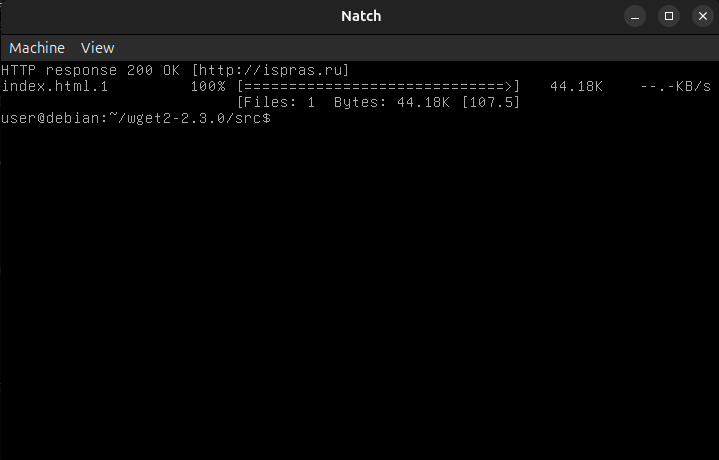

<a name="prepare_image"></a>

# Подготовка образа с объектом оценки

Работа с *Natch* предполагает подготовку образа операционной системы для [QEMU](https://wiki.qemu.org/Main_Page).
Как подготовить хостовую систему для использования инструмента описано в разделе
[Настройка окружения для работы с Natch](2_setup_env.md#setup_env).

Рассмотрим создание образа с нуля. Потребуются следующие шаги:

* Создание образа виртуальной машины
* Установка операционной системы в полученный образ
* Загрузка и сборка объекта оценки внутри образа
* Тестирование образа

## Создание образа виртуальной машины

Создать чистый образ для QEMU можно с помощью улилиты *qemu-img*. Для удобства пользователя мы включили
в командный интерфейс *Natch* команду `natch image`. Она представляет собой обертку над этой утилитой,
все аргументы команды передаются напрямую в *qemu-img*.

Скорее всего достаточно будет такой команды:
```text
natch image create -f qcow2 <image_name>.qcow2 100G
```
Размер образа устанавливается на ваше усмотрение и под ваши запросы.

Но если потребуются другие опции, то вызвать справку можно с помощью ключа `--help`, используя разделитель:
```text
natch image -- --help
```
На выходе получаем пустой qcow2-образ, можно переходить к следующему шагу.

## Установка ОС в образ

natch kvm --args "-cdrom"


## Сборка объекта оценки в образе

Перед загрузкой вашего ПО в образ, полезно ознакомиться с рекомендациями по подготовке исполняемого кода,
которые приведены в разделе [Рекомендации по подготовке и анализу объекта оценки](app7_oo_preparation.md#app_preparation).

В общем случае к анализируемому исполняемому коду выставляется два требования:

* Исполняемые файлы должны быть с отладочной информацией. Она может быть получена путем компиляции ПО с отладочными
  символами, приложена отдельно, также подойдут map-файлы. Предоставление символов непосредственно в составе исполняемых файлов
  является основным и рекомендуемым вариантом. *Natch* умеет извлекать информацию об отладочных символах из исполняемых файлов,
  собранных *как минимум* компиляторами *gcc* и *clang* с сохранением отладочной информации (ключ компилятора `-g`,
  также рекомендуется сборка без оптимизаций `-O0`). Для стандартных пакетов из наиболее популярных сборок операционных систем
  символы подгружаются автоматически.
* Рекомендуется выполнять сборку объекта оценки непосредственно в том образе, который будет передан *Natch*. В случае, если сборка и
  анализ будут выполняться в различных средах (например, сборка происходит на отдельном сборочном сервере), требуется обеспечить
  совместимость версий разделяемых динамических библиотек, в первую очередь *glibc*. На вашем хосте и в виртуализированной
  среде комплекты библиотек могут различаться.


Рассмотрим пошаговый пример подготовки объекта оценки.
В качестве объекта оценки возьмем программу *wget*. Для выполнения [скрипта `configure`](https://thoughtbot.com/blog/the-magic-behind-configure-make-make-install), входящего в комплект поставки *wget*,
потребуется установить дополнительные зависимости (скрипт выведет их наименования в случае неудачного завершения), например:
```bash
sudo apt install -y gnutls-dev gnutls-bin curl make gcc g++
```

Скачаем исходные тексты *wget* из репозитория:
```bash
curl -o wget-1.21.2.tar.gz  'https://ftp.gnu.org/gnu/wget/wget-1.21.2.tar.gz'
tar -xzf wget-1.21.2.tar.gz && cd wget-1.21.2
```
Скрипт `configure` запустим с ключами, устанавливающими параметры компилятора для сохранения отладочной информации.
После этого запустим `make` для сборки проекта.
```bash
CFLAGS='-g -O0' ./configure
make
```
### Перенос объекта оценки из образа на хост

В актуальной версии *Natch* этот шаг уже не является обязательным, но мы все равно рассмотрим эту
возможность. Для работы *Natch* необходимо иметь копии исполняемых файлов объекта оценки в
хостовой системе, поэтому один из вариантов этого достичь -- выгрузить их из образа в хост самостоятельно.

Чтобы выгрузить нужные файлы из виртуальной машины, можно использовать команду `natch files extract`
(подробнее в разделе [Командный интерфейс Natch](5_natch_cmd.md#cmd_files_extract)):

```bash
mkdir wget-1.21.2
natch files extract -i lubuntu.qcow2 -p /home/user/wget-1.21.2 -D wget-1.21.2 -e
```

С версии *Natch 3.2* файлы объекта оценки все еще нужны *Natch* для работы, но могут быть извлечены
автоматически на этапе конфигурирования проекта.


## Тестирование образа с объектом оценки

Для проверки работоспособности образа и установленного в нем ПО запустим *Natch* в режиме аппаратной виртуализации.
Команда запуска:

```bash
natch kvm -i lubuntu.qcow2 -m 4G
```
Дожидаемся загрузки ОС, авторизуемся, пробуем выполнить обращение к произвольному сетевому ресурсу с помощью
собранной нами версии *wget*:
```bash
cd wget-1.21.2/src && sudo ./wget ispras.ru
```
В результате вы должны увидеть приблизительно следующую картину в графическом окне QEMU,
свидетельствующую о том, что объект оценки корректно выполняется и сетевая доступность для
виртуальной машины обеспечена:

<figcaption>_Пример подготовленного ОО в QEMU_</figcaption>


