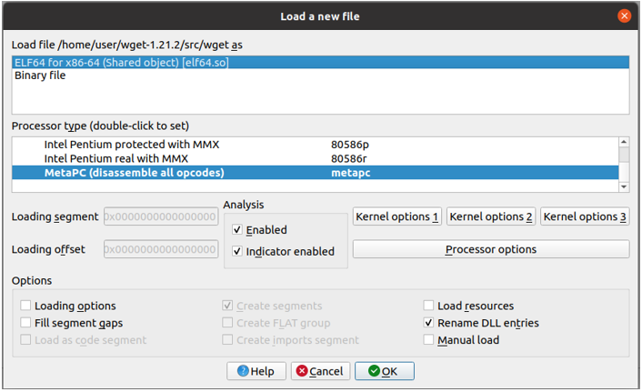
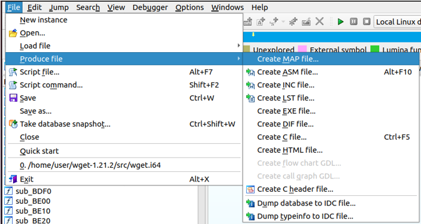

<div style="page-break-before:always;">
</div>


# <a name="app_preparation"></a>Приложение 8. Рекомендации по подготовке и анализу объекта оценки

## Подготовка образа исследуемой системы

Для того чтобы воспользоваться инструментом *Natch* необходимо подготовить образ системы,
совместимый с виртуальной машиной QEMU.

* Объект оценки должен быть собран внутри образа, а бинарные файлы выгружены наружу, чтобы
  и в гостевой и хостовой системах имелись одинаковые экземпляры (с версии 3.2 выгрузка может быть
  сделана автоматически на этапе создания проекта).

* Чтобы компиляция и настройка ПО внутри виртуальной машины проходила комфортней, рекомендуется
  запускать QEMU в режиме аппаратной виртуализации, что существенно ускорит работу гостевой системы.
  Для этого можно использовать команду `natch kvm`, или, если запускаете эмулятор с помощью собственной
  командной строки, виртуализация включается ключом `-enable-kvm`.


## Анализ приложений на компилируемых языках

Для отображения символьных имен функций в отчётах *Natch*,
нужно собирать ПО с отладочной информацией.
Natch поддерживает отладочную информацию в формате DWARF.
В любом современном компиляторе это достигается использованием ключа `-g`.
Если при этом отключать оптимизации (ключ `-O0`), то отображаемый в интерфейсе анализа стек вызовов будет более точным/понятным.

## Анализ приложений на языке Go

Приложения на языке Go имеют собственный (отличный от DWARF) формат отладочной информации.
Natch поддерживает анализ этой информации, если используется Go версии 1.2 или новее.
При сборке никакие дополнительные ключи не нужны, так как компилятор в любом
случае включает в исполняемый файл достаточно информации о имёнах функций и исходных файлов.

## <a name="natch_interpreters"></a>Использование Natch для интерпретируемых языков

Для наблюдения полноценной символьной информации в аналитиках *SNatch*, *Natch*
должен получить отладочную информацию не только для исследуемых модулей, но и для
используемых интерпретаторов.

С версии 3.2 есть возможность гибко настраивать получение отладочной информации
на этапе создания проекта, а также редактировать ее в дальнейшем при работе с проектом.
Информация о сборе отладочных символов находится в конфигурационном файле
`debug_info.cfg` (подробнее в разделе
[Конфигурационный файл для управления отладочной информацией debug_info.cfg](app2_configs.md#debug_config)),
который может быть отредактирован в любой момент после создания проекта
с помощью команды ([`natch edit debug`](3_natch_cmd.md#natch_cmd_edit)).
После редактирования следует выполнить команду `natch modules update`
([`natch modules update`](3_natch_cmd.md#natch_cmd_modules_update)).

При использовании стандартных Python, Java отладочная информация скачивается автоматически на
этапе создания проекта, если вы умышленно не отключите эту возможность в расширенных
настройках.


### <a name="interpreters_python"></a>Анализ Python приложений

При использовании собственной сборки Python необходимо отдельно предоставить отладочные символы,
в противном случае символизации Python-кода не будет.

Расположить отладочные символы можно по стандартному пути для
отладочных символов в системе, либо использовать расширенные настройки получения
отладочной информации на этапе создания проекта и указать собственный путь.

При использовании стандартной сборки следует проконтролировать, что символы будут загружены
(в случае если вы выбрали расширенные настройки получения отладочной информации, если нет,
все будет загружено автоматически).

### <a name="interpreters_java"></a>Анализ Java приложений

Как и в случае с Python, использование собственной сборки Java машины влечет необходимость
предоставления отладочных символов.

Расположить отладочные символы можно по стандартному пути для
отладочных символов в системе, либо использовать расширенные настройки получения
отладочной информации на этапе создания проекта и указать собственный путь.

Также, в связи с особенностями реализации интроспекции кода Java, для успешного проведения анализа
требуется включать в сценарий момент запуска Java-машины, в противном случае функции Java
не смогут быть распознаны.

## Получение map-файлов

Если по какой-то причине собрать программу с отладочной информацией невозможно, то для получения символов *Natch* может использовать
map-файлы. Получение map-файлов для исполняемого файла возможно с помощью сторонних инструментов.
Например, для генерации map-файла можно применить бесплатную версию дизассемблера
[IDA Pro](https://hex-rays.com/ida-free/). Для этого необходимо скачать установочный комплект по указанной ссылке и, возможно,
доустановить библиотеки Qt:
```bash
apt install -y qt5-default
```
После установки IDA необходимо запустить её, открыть интересующий исполняемый файл.

<figcaption>_Загрузка бинарного файла в IDA Pro_</figcaption>

Пройти процедуру генерации map-файла.

<figcaption>_Генерация map-файла_</figcaption>

Обязательным пунктом является только *Segmentation information*, остальные по желанию.

<figcaption>_Выбор опций map-файла_</figcaption>

Полученный map-файл должен быть помещен в папку с исполняемыми файлами, которые будут переданы в *Natch*.
Имя map-файла должно соответствовать имени бинарного файла, например, `program` -> `program.map`, `lib_x.so` -> `lib_x.so.map`.


## Анализ кластеров

Анализ кластеров из нескольких гостевых систем возможен по отдельности -- для каждой гостевой системы запускается отдельный экземпляр *Natch*.
Кластер можно связать через виртуальный коммутатор. Генерация совокупной интегральной поверхности атаки и ее единого графического представления не поддерживается.


## Анализ приложений внутри контейнеров

Если в вашей системе используются docker/podman-контейнеры, то, на данный момент, для получения максимально возможной
информации о них, сохранять состояние машины следует до запуска контейнеров.

